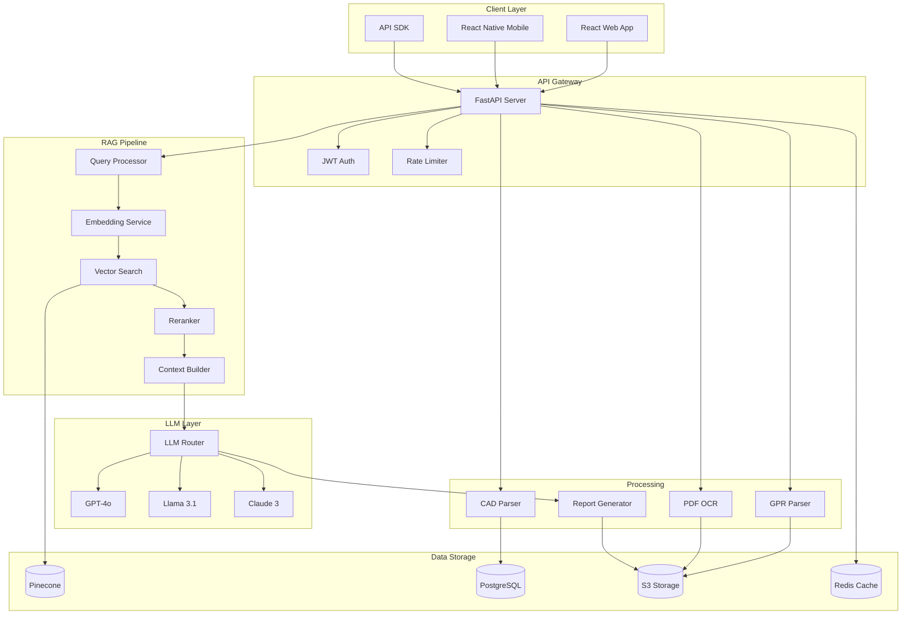

# Underground Utility Detection Platform
## Consolidated Technical Architecture

---

## System Architecture Overview



---

## Core Components

### 1. Data Ingestion Pipeline

#### Multi-Format Data Processing
```
Input Sources → Format Validation → Data Cleaning →
Normalization → Feature Extraction → Storage → Vectorization
```

**Supported Data Types**:
- **GPR Files**: SEG-Y, GSSI DZT, Sensors & Software DT1
- **Utility Records**: PDF (scanned), CAD, GIS shapefiles
- **CAD Drawings**: DWG, DXF, RVT (Revit)
- **Site Photos**: JPEG with EXIF data, GeoTIFF
- **Incident Reports**: Structured database, CSV exports

#### GPR Processing Workflow
```python
class GPRProcessingWorkflow:
    def process_gpr_file(self, file_path: str) -> ProcessedGPR:
        # Stage 1: File Validation
        validated_file = self.validate_segy_format(file_path)

        # Stage 2: Signal Processing
        processed_signal = self.apply_filters(
            data=validated_file,
            filters=['bandpass', 'gain_correction', 'background_removal']
        )

        # Stage 3: Feature Detection
        features = self.detect_hyperbolas(
            signal=processed_signal,
            method='hough_transform'
        )

        # Stage 4: Depth Calculation
        depths = self.calculate_depths(
            features=features,
            velocity_model=self.soil_velocity_model
        )

        # Stage 5: Utility Classification
        utilities = self.classify_utilities(
            features=features,
            model=self.trained_classifier
        )

        # Stage 6: Confidence Scoring
        confidence = self.calculate_confidence(
            signal_quality=processed_signal.snr,
            feature_clarity=features.score,
            model_certainty=utilities.probability
        )

        return ProcessedGPR(
            utilities=utilities,
            depths=depths,
            confidence=confidence
        )
```

### 2. RAG Engine Architecture

#### Vector Database Organization
```
Pinecone Index Structure:
├── Namespaces/
│   ├── pas128_compliance/
│   │   ├── specifications/    # 500+ chunks
│   │   ├── quality_levels/    # QL-A to QL-D criteria
│   │   └── best_practices/    # Industry guidelines
│   ├── project_{id}/
│   │   ├── utility_records/   # Historical data
│   │   ├── survey_data/       # Current project
│   │   └── site_context/      # Location-specific
│   └── incident_database/
│       ├── strike_reports/    # 10,000+ incidents
│       ├── near_misses/       # Risk indicators
│       └── lessons_learned/   # Prevention strategies
```

#### Multi-Stage Retrieval Pipeline
```python
class RAGQueryProcessor:
    def process_query(self, query: str, context: dict) -> Response:
        # Stage 1: Query Understanding
        parsed_query = self.understand_query(
            text=query,
            intent_classifier=self.intent_model,
            entity_extractor=self.ner_model
        )

        # Stage 2: Query Expansion
        expanded_queries = self.expand_query(
            original=parsed_query,
            synonyms=self.domain_synonyms,
            abbreviations=self.utility_abbreviations
        )

        # Stage 3: Multi-Index Search
        search_results = []
        for namespace in ['pas128', f'project_{context.project_id}', 'incidents']:
            results = self.vector_search(
                query=expanded_queries,
                namespace=namespace,
                top_k=20,
                filter=context.filters
            )
            search_results.extend(results)

        # Stage 4: Reranking
        reranked = self.rerank_results(
            query=query,
            documents=search_results,
            model='cohere-rerank-english-v3.0',
            top_k=10
        )

        # Stage 5: Context Assembly
        context_window = self.build_context(
            documents=reranked,
            max_tokens=8000,
            strategy='mmr'  # Maximal Marginal Relevance
        )

        # Stage 6: Response Generation
        response = self.generate_response(
            query=query,
            context=context_window,
            model='gpt-4o',
            temperature=0.3,
            citations=True
        )

        return response
```

### 3. ML/AI Model Architecture

#### Utility Detection Models
```python
class GPRInterpreter:
    """Multi-task learning model for GPR interpretation"""

    def __init__(self):
        self.backbone = ResNet50(pretrained=True)
        self.detection_head = YOLOv8()  # Utility detection
        self.depth_head = RegressionHead()  # Depth estimation
        self.classification_head = ClassificationHead()  # Utility type

    def forward(self, radargram):
        features = self.backbone(radargram)

        detections = self.detection_head(features)
        depths = self.depth_head(features)
        utility_types = self.classification_head(features)

        return {
            'detections': detections,  # Bounding boxes
            'depths': depths,          # Meters below surface
            'types': utility_types,     # Gas/Electric/Water/etc
            'confidence': self.calculate_confidence(features)
        }
```

#### Risk Scoring Model
```python
class StrikeRiskPredictor:
    """Ensemble model for utility strike risk prediction"""

    def predict_risk(self, project_data: dict) -> RiskScore:
        # Feature extraction
        features = self.extract_features(
            utility_positions=project_data['utilities'],
            soil_conditions=project_data['soil'],
            historical_strikes=project_data['area_history'],
            excavation_plan=project_data['construction'],
            detection_confidence=project_data['confidence']
        )

        # Ensemble prediction
        predictions = []

        # Random Forest
        rf_pred = self.random_forest.predict_proba(features)
        predictions.append(rf_pred)

        # Gradient Boosting
        gb_pred = self.gradient_boost.predict_proba(features)
        predictions.append(gb_pred)

        # Neural Network
        nn_pred = self.neural_net.predict(features)
        predictions.append(nn_pred)

        # Weighted ensemble
        final_risk = self.weighted_average(
            predictions=predictions,
            weights=[0.3, 0.3, 0.4]
        )

        return RiskScore(
            probability=final_risk,
            risk_level=self.categorize_risk(final_risk),
            contributing_factors=self.explain_risk(features),
            mitigation_steps=self.recommend_mitigations(final_risk)
        )
```

### 4. Report Generation Engine

#### Automated PAS 128 Report Builder
```python
class ReportGenerator:
    """Automated PAS 128 compliant report generation"""

    def generate_report(self, survey_data: dict) -> Report:
        # Section 1: Executive Summary
        summary = self.generate_section(
            template=PAS128_SUMMARY_TEMPLATE,
            data=survey_data,
            model='gpt-4o',
            max_tokens=500
        )

        # Section 2: Methodology
        methodology = self.generate_methodology(
            equipment=survey_data['equipment'],
            standards=['PAS128:2022'],
            procedures=survey_data['procedures']
        )

        # Section 3: Findings
        findings = self.generate_findings(
            utilities=survey_data['detected_utilities'],
            quality_levels=self.assign_quality_levels(survey_data),
            confidence_scores=survey_data['confidence']
        )

        # Section 4: Risk Assessment
        risk_assessment = self.generate_risk_assessment(
            risk_scores=survey_data['risk_analysis'],
            incidents_nearby=survey_data['historical_incidents'],
            recommendations=self.generate_recommendations(survey_data)
        )

        # Section 5: Compliance Statement
        compliance = self.generate_compliance_statement(
            standards_met=['PAS128:2022', 'CDM2015'],
            limitations=survey_data['limitations'],
            certifications=self.verify_compliance(survey_data)
        )

        # Compile with citations
        report = self.compile_report(
            sections=[summary, methodology, findings, risk_assessment, compliance],
            citations=self.extract_citations(),
            appendices=self.prepare_appendices(survey_data)
        )

        return report
```

---

## Microservices Architecture

### Service Breakdown
```
Services Architecture:
├── api-gateway/           # FastAPI main application
├── ingestion-service/     # File processing workers
├── rag-service/          # RAG query handling
├── ml-service/           # GPR interpretation, risk scoring
├── report-service/       # Document generation
├── notification-service/ # Alerts and webhooks
└── audit-service/        # Compliance logging
```

### Inter-Service Communication
```yaml
# Service Communication Matrix
services:
  api-gateway:
    communicates_with: [ingestion, rag, ml, report, audit]
    protocol: HTTP/REST

  ingestion-service:
    communicates_with: [ml-service, rag-service]
    protocol: Event-driven (SQS)

  rag-service:
    communicates_with: [ml-service, report-service]
    protocol: gRPC

  ml-service:
    communicates_with: [report-service]
    protocol: Message Queue (Redis)
```

---

## Data Storage Architecture

### Storage Strategy
```
Data Storage Layer:
├── Pinecone Vector DB
│   ├── Embeddings storage
│   ├── Metadata filtering
│   └── Real-time search
├── PostgreSQL
│   ├── Transactional data
│   ├── User management
│   └── Project metadata
├── S3 Storage
│   ├── Raw files (GPR, PDF, CAD)
│   ├── Processed data
│   └── Generated reports
└── Redis Cache
    ├── Session data
    ├── Query cache
    └── Real-time features
```

### Data Flow Architecture
```
Field Data Collection → Multi-Modal Ingestion → Processing & Correlation
→ RAG Enhancement → Report Generation → Compliance Validation → Delivery
```

---

## Security & Compliance

### Security Architecture
```
Security Layers:
├── Input Encryption
│   ├── TLS 1.3 for transit
│   └── Client-side encryption for sensitive data
├── Processing Security
│   ├── Isolated compute environments
│   ├── Memory encryption
│   └── Secure enclaves for ML
├── Storage Encryption
│   ├── AES-256-GCM at rest
│   ├── Key rotation every 90 days
│   └── Hardware security modules (HSM)
└── Access Control
    ├── Multi-factor authentication
    ├── Role-based permissions
    └── Project-level isolation
```

### Compliance Framework
```python
class PAS128Validator:
    """Ensure reports meet PAS 128:2022 requirements"""

    def validate_report(self, report: Report) -> ValidationResult:
        checks = [
            self.check_quality_levels(),      # QL-A to QL-D properly assigned
            self.check_metadata_complete(),   # All required fields present
            self.check_coordinate_system(),   # OSGB36 or WGS84
            self.check_confidence_scores(),   # All detections have confidence
            self.check_survey_extent(),       # Coverage area documented
            self.check_limitations(),         # Survey limitations noted
        ]

        return ValidationResult(
            passed=all(checks),
            issues=[c.issue for c in checks if not c.passed]
        )
```

### Audit Trail
```python
class AuditLogger:
    """Immutable audit trail for compliance"""

    def log_action(self, action: Action):
        entry = {
            "timestamp": datetime.utcnow().isoformat(),
            "user_id": action.user_id,
            "action_type": action.type,
            "project_id": action.project_id,
            "details": action.details,
            "ip_address": action.ip_address,
            "hash": self.compute_hash(action)
        }

        # Write to immutable storage
        self.s3_client.put_object(
            Bucket="audit-logs-prod",
            Key=f"{entry['timestamp']}-{entry['hash']}.json",
            Body=json.dumps(entry),
            StorageClass="GLACIER"  # Long-term compliance storage
        )
```

---

## Performance Optimization

### Caching Strategy
```
Cache Layers:
├── L1: Browser Cache (1 hour)
│   └── Static assets, UI components
├── L2: CDN Cache (CloudFront)
│   └── Reports, images, documents
├── L3: Application Cache (Redis)
│   ├── Session data (15 minutes)
│   ├── Query results (1 hour)
│   └── Embeddings (24 hours)
├── L4: Database Cache
│   ├── Query cache (PostgreSQL)
│   └── Materialized views
└── L5: ML Model Cache
    ├── Inference results (1 hour)
    └── Feature vectors (6 hours)
```

### Scaling Architecture
```yaml
# Kubernetes scaling configuration
apiVersion: autoscaling/v2
kind: HorizontalPodAutoscaler
metadata:
  name: rag-service-hpa
spec:
  scaleTargetRef:
    apiVersion: apps/v1
    kind: Deployment
    name: rag-service
  minReplicas: 2
  maxReplicas: 20
  metrics:
  - type: Resource
    resource:
      name: cpu
      target:
        type: Utilization
        averageUtilization: 70
  - type: Resource
    resource:
      name: memory
      target:
        type: Utilization
        averageUtilization: 80
```

---

## Technology Stack

### Core Technologies
| Component | Technology | Rationale |
|-----------|------------|-----------|
| Backend Framework | FastAPI | Async support, automatic OpenAPI docs |
| Vector DB | Pinecone | Managed service, <100ms latency |
| Primary LLM | GPT-4o | Best report quality, 128k context |
| Embedding Model | text-embedding-3-small | Cost/performance balance |
| Reranker | Cohere rerank-v3 | Superior accuracy for technical docs |
| OCR Engine | Tesseract 5.0 | Open source, good accuracy |
| CAD Parser | ezdxf | Pure Python, supports DXF/DWG |
| Cloud Provider | AWS | Better GPU availability |
| Container Orchestration | EKS | Managed Kubernetes |
| Monitoring | Datadog + Langfuse | APM + LLM observability |

### Development Stack
```
Development Tools:
├── Language: Python 3.11+
├── Framework: FastAPI
├── Frontend: React 18 + TypeScript
├── Mobile: React Native / PWA
├── Database: PostgreSQL 15
├── Cache: Redis 7
├── Queue: AWS SQS
├── Storage: AWS S3
├── CI/CD: GitHub Actions
├── Monitoring: Langfuse + DataDog
└── Testing: pytest + Playwright
```

---

## Deployment Architecture

### Infrastructure as Code
```yaml
# kubernetes/deployment.yaml
apiVersion: apps/v1
kind: Deployment
metadata:
  name: rag-api
spec:
  replicas: 3
  strategy:
    type: RollingUpdate
    rollingUpdate:
      maxSurge: 1
      maxUnavailable: 0
  template:
    spec:
      containers:
      - name: api
        image: rag-platform:latest
        resources:
          requests:
            memory: "2Gi"
            cpu: "1000m"
          limits:
            memory: "4Gi"
            cpu: "2000m"
        env:
        - name: PINECONE_API_KEY
          valueFrom:
            secretKeyRef:
              name: api-secrets
              key: pinecone-key
```

### Multi-Region Deployment
```
Geographic Distribution:
├── Primary: eu-west-2 (London)
├── Secondary: eu-west-1 (Ireland)
└── Archive: us-east-1 (Virginia)

Recovery Targets:
├── RTO: 4 hours
├── RPO: 1 hour
└── Availability: 99.9%
```

---

## Performance Benchmarks

| Operation | Target | Current | Notes |
|-----------|--------|---------|-------|
| GPR file processing | <30s | 25s | For 100MB file |
| PDF OCR + extraction | <10s | 8s | 20-page document |
| Vector search | <100ms | 85ms | 10M vectors |
| Report generation | <60s | 45s | Full PAS 128 report |
| End-to-end pipeline | <10min | 8min | Complete survey processing |

### Scalability Targets
- **Year 1**: 1,000 reports/month, 50 concurrent users
- **Year 2**: 10,000 reports/month, 500 concurrent users
- **Year 3**: 50,000 reports/month, 2,000 concurrent users

---

## Monitoring & Observability

### Key Metrics
```python
METRICS = {
    "business": [
        "reports_generated_per_day",
        "average_report_generation_time",
        "utility_strike_prevention_rate",
        "user_satisfaction_score"
    ],
    "technical": [
        "api_latency_p50_p95_p99",
        "embedding_cache_hit_rate",
        "llm_token_usage_by_model",
        "vector_search_latency",
        "storage_usage_by_project"
    ],
    "quality": [
        "report_accuracy_score",
        "false_positive_rate",
        "confidence_calibration",
        "user_correction_rate"
    ]
}
```

### Observability Stack
```
Monitoring Architecture:
├── Metrics (Prometheus)
│   ├── Application metrics
│   ├── Infrastructure metrics
│   └── Business metrics
├── Logging (ELK Stack)
│   ├── Application logs
│   ├── Audit logs
│   └── Error tracking
├── Tracing (Jaeger)
│   ├── Request flow
│   ├── Latency analysis
│   └── Dependency mapping
└── LLM Monitoring (Langfuse)
    ├── Token usage
    ├── Response quality
    ├── Hallucination detection
    └── Cost tracking
```

---

## Disaster Recovery & Business Continuity

### Backup Strategy
```
Backup Architecture:
├── Real-time Replication
│   ├── Database (Multi-AZ RDS)
│   ├── Vector DB (Pinecone replicas)
│   └── Cache (Redis Cluster)
├── Scheduled Backups
│   ├── Daily snapshots (30 day retention)
│   ├── Weekly full backup (90 day retention)
│   └── Monthly archive (7 year retention)
└── Recovery Testing
    ├── Monthly DR drills
    ├── Automated failover tests
    └── Data integrity checks
```

### Failover Procedures
```
Failover Decision Tree:
IF service_health_check_fails THEN
  IF retry_count < 3 THEN
    wait(30_seconds)
    retry_health_check()
  ELSE
    initiate_failover()

failover_procedure():
  1. Route traffic to standby region
  2. Promote read replica to primary
  3. Update DNS records
  4. Notify operations team
  5. Begin root cause analysis
  6. Plan recovery to primary
```

---

## API Design

### RESTful API Structure
```
API Structure:
├── /api/v1/
│   ├── /auth/
│   │   ├── POST /login
│   │   ├── POST /logout
│   │   └── POST /refresh
│   ├── /projects/
│   │   ├── GET /projects
│   │   ├── POST /projects
│   │   ├── GET /projects/{id}
│   │   ├── PUT /projects/{id}
│   │   └── DELETE /projects/{id}
│   ├── /surveys/
│   │   ├── POST /surveys/upload
│   │   ├── GET /surveys/{id}/status
│   │   └── GET /surveys/{id}/results
│   ├── /reports/
│   │   ├── POST /reports/generate
│   │   ├── GET /reports/{id}
│   │   └── GET /reports/{id}/download
│   └── /analysis/
│       ├── POST /analysis/risk
│       ├── POST /analysis/correlation
│       └── GET /analysis/{id}/results
```

---

## Development & Testing

### Testing Strategy
```
Testing Levels:
├── Unit Tests (70%)
│   ├── Function-level tests
│   ├── Class tests
│   └── Module tests
├── Integration Tests (20%)
│   ├── API tests
│   ├── Database tests
│   └── Service tests
├── E2E Tests (10%)
│   ├── User workflows
│   ├── Cross-browser
│   └── Mobile tests
└── Performance Tests
    ├── Load testing
    ├── Stress testing
    └── Spike testing
```

### Quality Gates
```
Quality Standards:
├── Coverage: >80% code coverage
├── Complexity: Cyclomatic complexity <10
├── Duplication: <3% duplicate code
├── Security: Zero high-severity vulnerabilities
├── Performance: P95 latency <200ms
├── Reliability: 99.9% uptime
└── Maintainability: A rating in SonarQube
```

---

*This consolidated architecture document provides a comprehensive technical blueprint for building an enterprise-grade Underground Utility Detection Platform with scalability, reliability, security, performance, compliance, and extensibility as core design principles.*