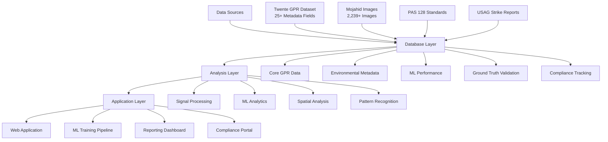
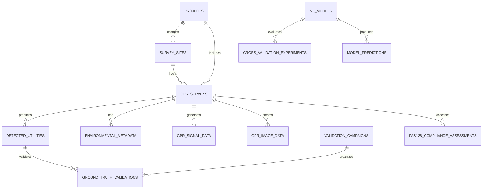

# Underground Utility Detection Platform - Database Documentation

## Overview

This comprehensive PostgreSQL database is designed to support the Underground Utility Detection Platform, providing robust storage and analysis capabilities for Ground Penetrating Radar (GPR) feature analysis, machine learning model performance tracking, and compliance management.

## Table of Contents

1. [Architecture Overview](#architecture-overview)
2. [Database Schema Design](#database-schema-design)
3. [Dataset Integration](#dataset-integration)
4. [Installation and Setup](#installation-and-setup)
5. [Usage Examples](#usage-examples)
6. [Performance Optimization](#performance-optimization)
7. [Compliance and Quality Assurance](#compliance-and-quality-assurance)
8. [API Reference](#api-reference)
9. [Maintenance Procedures](#maintenance-procedures)
10. [Troubleshooting](#troubleshooting)

## Architecture Overview

### System Architecture



### Core Database Features

- **Spatial Data Support**: PostGIS for geographic and coordinate-based analysis
- **Vector Storage**: PostgreSQL vector extension for ML embeddings and similarity search
- **Time Series Analysis**: Optimized storage for GPR signal time-series data
- **Compliance Tracking**: Comprehensive PAS 128:2022 compliance management
- **Performance Monitoring**: Built-in ML model performance tracking and cross-validation
- **Audit Trail**: Complete audit logging for all data modifications

## Database Schema Design

### Schema Organization

The database is organized into logical schemas for better maintainability:

```sql
-- Schema structure
public          -- Core tables and main entities
gpr_data        -- GPR survey data and signal processing
environmental   -- Environmental metadata and correlations
validation      -- Ground truth validation and accuracy assessment
ml_analytics    -- Machine learning model performance
compliance      -- PAS 128 compliance and quality assurance
historical      -- Historical incident data and patterns
utilities       -- Utility functions and procedures
```

### Core Entity Relationships



### Key Tables Overview

#### Core Project Management
- **projects**: Main project organization and metadata
- **survey_sites**: Geographic locations and site characteristics
- **gpr_surveys**: Individual GPR survey records with comprehensive metadata

#### GPR Data and Signal Processing
- **gpr_signal_data**: Raw and processed GPR signal characteristics
- **gpr_signal_timeseries**: Enhanced time-series analysis
- **gpr_frequency_analysis**: Frequency domain analysis and spectral features
- **gpr_hyperbola_analysis**: Hyperbola detection and velocity estimation
- **detected_utilities**: Utility detection results with confidence scores

#### Environmental Integration
- **environmental_metadata**: Comprehensive environmental data (25+ Twente fields)
- **environmental_impact_analysis**: Environmental factor correlation analysis
- **ground_conditions**: Standardized ground condition classifications
- **weather_conditions**: Weather impact and GPR setting recommendations

#### Machine Learning Analytics
- **ml_models**: Complete ML model registry and lifecycle management
- **cross_validation_experiments**: Detailed cross-validation tracking
- **cv_fold_results**: Individual fold performance metrics
- **model_performance_monitoring**: Continuous performance and drift detection
- **feature_importance_analysis**: Feature analysis with stability metrics

#### Ground Truth and Validation
- **validation_campaigns**: Validation campaign management and planning
- **ground_truth_validations**: Detailed validation records with accuracy assessment
- **accuracy_assessment_summary**: Aggregated accuracy metrics and statistics

#### Compliance and Quality
- **pas128_compliance_assessments**: PAS 128:2022 compliance tracking
- **pas128_quality_levels**: Quality level definitions and requirements
- **quality_level_determination_rules**: Automated quality level determination

#### Historical Analysis
- **usag_strike_incidents**: Historical utility strike incident data
- **strike_pattern_analysis**: Spatial and temporal pattern analysis
- **strike_prevention_measures**: Prevention measure effectiveness tracking

## Dataset Integration

### University of Twente GPR Dataset

The database fully supports the Twente dataset with all 25+ metadata fields:

**Location and Site Context:**
- Location IDs (01.1, 01.2, etc.)
- Site classification and surveying objectives
- Construction context and work activities

**Environmental Conditions:**
- Ground conditions (sandy, clayey, mixed)
- Ground relative permittivity (8.16-19.46 range)
- Weather conditions and impacts
- Groundwater levels and drainage

**Utility Infrastructure:**
- Amount of utilities (0-5+ range)
- Utility crossings and path complexity
- Known utility records availability

**Quality and Validation:**
- Detection accuracy and confidence scores
- Ground truth validation results
- PAS 128 quality level assignments

### Mojahid GPR Images Dataset

Complete integration of the 2,239+ image dataset:

**Image Categories:**
- `cavities`: Void and cavity detection
- `intact`: Normal ground conditions
- `utilities`: Utility object detection
- `augmented_cavities`: Augmented cavity images
- `augmented_intact`: Augmented normal images
- `augmented_utilities`: Augmented utility images

**ML Training Support:**
- Feature vector storage for similarity search
- Bounding box annotations for object detection
- Ground truth labels and verification status
- Image metadata and preprocessing parameters

### PAS 128:2022 Compliance Integration

Full compliance tracking and automation:

**Quality Levels:**
- QL-A: ±40mm horizontal, ±75mm depth (excavation required)
- QL-B: ±200mm horizontal, ±300mm depth (survey grade)
- QL-C: ±500mm horizontal, ±500mm depth (general information)
- QL-D: ±1000mm horizontal, ±1000mm depth (schematic)

**Automated Determination:**
- Rule-based quality level assignment
- Environmental factor consideration
- Risk assessment integration
- Compliance validation functions

### USAG Strike Reports

Historical incident analysis capabilities:

**Incident Classification:**
- Strike incident categories and severity levels
- Utility type involvement and damage assessment
- Root cause analysis and contributing factors
- Prevention measure effectiveness tracking

**Spatial-Temporal Analysis:**
- Geographic clustering and hotspot identification
- Seasonal and temporal pattern detection
- Risk factor correlation analysis
- Predictive modeling support

## Installation and Setup

### Prerequisites

- PostgreSQL 14.0 or higher
- PostGIS 3.0 or higher
- PostgreSQL Vector extension
- Minimum 8GB RAM recommended
- 100GB+ storage for full dataset

### Installation Steps

1. **Initialize Database**
   ```bash
   psql -U postgres -d your_database -f 00_master_init.sql
   ```

2. **Deploy Schema Files**
   ```bash
   psql -U postgres -d your_database -f schemas/gpr_infrastructure_schema.sql
   psql -U postgres -d your_database -f schemas/enhanced_signal_analysis_schema.sql
   psql -U postgres -d your_database -f schemas/environmental_metadata_schema.sql
   psql -U postgres -d your_database -f schemas/ground_truth_validation_schema.sql
   psql -U postgres -d your_database -f schemas/ml_performance_schema.sql
   psql -U postgres -d your_database -f schemas/pas128_compliance_schema.sql
   psql -U postgres -d your_database -f schemas/usag_strike_reports_schema.sql
   ```

3. **Load Sample Data**
   ```bash
   psql -U postgres -d your_database -f sample_data_loading.sql
   ```

4. **Apply Optimizations**
   ```bash
   psql -U postgres -d your_database -f database_optimization.sql
   ```

### Configuration

**PostgreSQL Settings** (postgresql.conf):
```ini
shared_buffers = 512MB
effective_cache_size = 2GB
work_mem = 64MB
maintenance_work_mem = 256MB
max_connections = 200
random_page_cost = 1.1
max_parallel_workers = 8
max_parallel_workers_per_gather = 4
```

**Security Configuration**:
```sql
-- Change default passwords immediately
ALTER USER gpr_admin PASSWORD 'your_secure_admin_password';
ALTER USER gpr_analyst PASSWORD 'your_secure_analyst_password';
ALTER USER gpr_app_user PASSWORD 'your_secure_app_password';
ALTER USER gpr_readonly PASSWORD 'your_secure_readonly_password';
```

## Usage Examples

### Basic GPR Survey Queries

**Find surveys with high utility density:**
```sql
SELECT s.location_id, s.survey_date, s.amount_of_utilities, s.confidence_score
FROM gpr_surveys s
WHERE s.amount_of_utilities >= 3
ORDER BY s.confidence_score DESC;
```

**Environmental correlation analysis:**
```sql
SELECT
    em.ground_relative_permittivity,
    AVG(s.confidence_score) as avg_confidence,
    COUNT(*) as survey_count
FROM environmental_metadata em
JOIN gpr_surveys s ON em.survey_id = s.id
GROUP BY em.ground_relative_permittivity
ORDER BY em.ground_relative_permittivity;
```

### Spatial Analysis Queries

**Find utilities within radius of location:**
```sql
SELECT du.utility_discipline, du.depth_m, du.confidence_score
FROM detected_utilities du
WHERE ST_DWithin(
    du.coordinates,
    ST_SetSRID(ST_Point(6.8936, 52.2387), 4326),
    0.001  -- ~100m radius
)
ORDER BY du.confidence_score DESC;
```

**Hotspot analysis for utility strikes:**
```sql
SELECT
    ST_AsText(ST_Centroid(ST_Collect(incident_location))) as hotspot_center,
    COUNT(*) as incident_count,
    AVG(estimated_repair_cost) as avg_cost
FROM usag_strike_incidents
WHERE incident_date >= CURRENT_DATE - INTERVAL '1 year'
GROUP BY ST_SnapToGrid(incident_location, 0.01)
HAVING COUNT(*) >= 3
ORDER BY incident_count DESC;
```

### ML Performance Analysis

**Model leaderboard:**
```sql
SELECT
    model_name,
    model_version,
    mean_f1_score,
    performance_stability_score,
    overall_rank
FROM model_performance_leaderboard
ORDER BY overall_rank;
```

**Cross-validation analysis:**
```sql
SELECT
    m.model_name,
    cv.mean_accuracy,
    cv.std_accuracy,
    cv.performance_stability_score
FROM cross_validation_experiments cv
JOIN ml_models m ON cv.model_id = m.id
WHERE cv.status = 'completed'
ORDER BY cv.mean_f1_score DESC;
```

### Compliance and Quality Assessment

**PAS 128 compliance summary:**
```sql
SELECT
    project_name,
    quality_level_code,
    total_assessments,
    compliant_assessments,
    average_compliance_score
FROM pas128_compliance_summary
ORDER BY average_compliance_score DESC;
```

**Quality level determination:**
```sql
SELECT * FROM determine_quality_level(
    'survey_uuid_here',
    'construction',  -- application context
    'medium',        -- project risk
    200,            -- required horizontal accuracy (mm)
    300             -- required vertical accuracy (mm)
);
```

### Validation and Accuracy Assessment

**Validation campaign performance:**
```sql
SELECT
    campaign_name,
    total_validations,
    true_positives,
    false_positives,
    avg_horizontal_error_mm,
    avg_depth_error_mm
FROM validation_performance_summary
ORDER BY campaign_name;
```

**Ground truth accuracy by utility type:**
```sql
SELECT
    gtv.actual_utility_type,
    COUNT(*) as validations,
    AVG(ABS(gtv.horizontal_position_error_mm)) as avg_horizontal_error,
    AVG(ABS(gtv.depth_error_mm)) as avg_depth_error,
    COUNT(CASE WHEN gtv.detection_result = 'true_positive' THEN 1 END) * 100.0 / COUNT(*) as detection_rate
FROM ground_truth_validations gtv
WHERE gtv.utility_present = true
GROUP BY gtv.actual_utility_type
ORDER BY detection_rate DESC;
```

## Performance Optimization

### Indexing Strategy

The database includes comprehensive indexing for optimal performance:

**Spatial Indexes:**
- GiST indexes on all geometric columns
- Optimized spatial queries for location-based analysis

**Composite Indexes:**
- Multi-column indexes for common query patterns
- Include columns for covering index benefits

**Vector Indexes:**
- IVFFlat indexes for ML embedding similarity search
- Optimized for image feature matching

**Time-Series Indexes:**
- Specialized indexes for signal processing queries
- Optimized depth and time-based filtering

### Query Optimization

**Use provided optimization functions:**
```sql
-- Analyze query performance
SELECT * FROM analyze_query_performance(10, 1000);

-- Check for missing indexes
SELECT * FROM suggest_missing_indexes();

-- Monitor database health
SELECT * FROM check_database_health();

-- Performance benchmarking
SELECT * FROM run_performance_benchmark();
```

### Maintenance Procedures

**Daily:**
```sql
SELECT refresh_critical_views();
```

**Weekly:**
```sql
SELECT smart_vacuum_analyze();
```

**Monthly:**
```sql
SELECT check_database_health();
SELECT analyze_all_tables();
```

**Quarterly:**
```sql
SELECT run_performance_benchmark();
SELECT get_optimization_summary();
```

## Compliance and Quality Assurance

### PAS 128:2022 Integration

The database provides complete PAS 128:2022 compliance support:

**Automated Quality Level Determination:**
- Risk-based assessment
- Environmental factor consideration
- Application context analysis
- Accuracy requirement matching

**Compliance Validation:**
- Automated compliance checking
- Detailed assessment reports
- Non-conformance tracking
- Corrective action management

**Quality Control:**
- Statistical validation
- Confidence interval calculation
- Sample size adequacy assessment
- Measurement uncertainty analysis

### Data Quality Assurance

**Audit Trail:**
- Complete change tracking
- User activity logging
- Data lineage maintenance
- Integrity constraint enforcement

**Validation Rules:**
- Data completeness scoring
- Quality score calculation
- Consistency checks
- Business rule validation

## API Reference

### Core Functions

#### Database Management
```sql
-- Get database statistics
SELECT * FROM get_database_statistics();

-- Refresh all materialized views
SELECT refresh_all_materialized_views();

-- Analyze all tables
SELECT analyze_all_tables();
```

#### Signal Processing
```sql
-- Calculate signal penetration depth
SELECT calculate_signal_penetration_depth('survey_uuid', -40.0);

-- Refresh signal analysis views
SELECT refresh_signal_analysis_views();
```

#### Environmental Analysis
```sql
-- Calculate environmental impact score
SELECT calculate_environmental_impact_score('survey_uuid');

-- Refresh environmental analysis views
SELECT refresh_environmental_analysis_views();
```

#### ML Performance
```sql
-- Calculate model complexity score
SELECT calculate_model_complexity_score('model_uuid');

-- Refresh ML analytics views
SELECT refresh_ml_analytics_views();
```

#### Validation and Accuracy
```sql
-- Calculate detection metrics
SELECT * FROM calculate_detection_metrics('campaign_uuid');

-- Update campaign statistics
SELECT update_campaign_statistics('campaign_uuid');

-- Refresh validation analysis views
SELECT refresh_validation_analysis_views();
```

#### Compliance
```sql
-- Determine quality level
SELECT * FROM determine_quality_level('survey_uuid', 'construction', 'medium', 200, 300);

-- Validate PAS 128 compliance
SELECT * FROM validate_pas128_compliance('survey_uuid', 'QL-B');

-- Refresh PAS 128 views
SELECT refresh_pas128_views();
```

#### Strike Analysis
```sql
-- Calculate strike risk score
SELECT calculate_strike_risk_score(ST_Point(6.8936, 52.2387), 1000, 5);

-- Refresh strike analysis views
SELECT refresh_strike_analysis_views();
```

### Materialized Views

The database includes several materialized views for performance:

- `survey_statistics`: Survey summary across projects
- `signal_quality_summary`: Signal quality metrics per survey
- `environmental_conditions_summary`: Environmental data overview
- `validation_performance_summary`: Validation campaign metrics
- `model_performance_leaderboard`: ML model rankings
- `pas128_compliance_summary`: Compliance status overview
- `annual_strike_statistics`: Yearly strike incident trends

## Troubleshooting

### Common Issues

**Slow Query Performance:**
1. Check query execution plan: `EXPLAIN ANALYZE your_query;`
2. Review index usage: `SELECT * FROM suggest_missing_indexes();`
3. Update table statistics: `ANALYZE table_name;`
4. Consider query rewriting for better performance

**High Memory Usage:**
1. Check work_mem settings for complex queries
2. Monitor active connections: `SELECT * FROM pg_stat_activity;`
3. Review maintenance_work_mem for VACUUM operations
4. Consider connection pooling (PgBouncer)

**Index Maintenance:**
1. Monitor index usage: `SELECT * FROM pg_stat_user_indexes WHERE idx_scan = 0;`
2. Rebuild indexes if needed: `REINDEX INDEX index_name;`
3. Consider partial indexes for large tables
4. Regular VACUUM and ANALYZE operations

**Materialized View Issues:**
1. Check dependencies before refresh
2. Use CONCURRENTLY option where possible
3. Monitor refresh duration and system load
4. Consider incremental refresh strategies

### Performance Monitoring

**Key Metrics to Monitor:**
- Query response times
- Index hit ratios
- Table scan frequency
- Lock contention
- Connection pool utilization
- Disk I/O patterns

**Monitoring Queries:**
```sql
-- Check cache hit ratio
SELECT
    sum(heap_blks_read) as heap_read,
    sum(heap_blks_hit) as heap_hit,
    sum(heap_blks_hit) / (sum(heap_blks_hit) + sum(heap_blks_read)) as ratio
FROM pg_statio_user_tables;

-- Monitor long-running queries
SELECT * FROM check_long_running_queries('5 minutes');

-- Check for bloated tables
SELECT schemaname, tablename, attname, n_distinct, correlation
FROM pg_stats
WHERE schemaname = 'public'
ORDER BY n_distinct DESC;
```

### Backup and Recovery

**Backup Strategy:**
```bash
# Full database backup
pg_dump -h localhost -U postgres -d gpr_database > backup_$(date +%Y%m%d).sql

# Schema-only backup
pg_dump -h localhost -U postgres -d gpr_database --schema-only > schema_backup.sql

# Data-only backup
pg_dump -h localhost -U postgres -d gpr_database --data-only > data_backup.sql
```

**Point-in-Time Recovery:**
1. Enable WAL archiving in postgresql.conf
2. Configure archive_command
3. Take regular base backups
4. Test recovery procedures regularly

### Support and Contact

For technical support and questions:
- Database architecture questions: Review this documentation
- Performance issues: Use built-in monitoring functions
- Schema modifications: Follow proper change management procedures
- Data quality issues: Check audit logs and validation functions

---

**Documentation Version:** 1.0.0
**Last Updated:** September 2024
**Database Version Compatibility:** PostgreSQL 14.0+, PostGIS 3.0+
**License:** Project-specific license terms apply