# Infrastructure Intelligence Platform - Architecture Diagrams

This document contains all system architecture diagrams in Mermaid format. These diagrams can be rendered in GitHub, GitLab, and most modern documentation tools.

---

## Table of Contents

### Phase 1A - Current System
1. [Local Development Architecture](#1-local-development-architecture-docker-compose)
2. [Data Flow & Processing Pipeline](#2-data-flow--processing-pipeline)
3. [Frontend Component Architecture](#3-frontend-component-architecture)
4. [Database Schema Extension](#4-database-schema-extension)
5. [New Feature Development Workflow](#5-new-feature-development-workflow)
6. [Docker Local Development Workflow](#6-docker-local-development-workflow)

### Phase 1D - Multi-Domain Intelligence (NEW)
7. [Safety Intelligence Platform Architecture](#7-safety-intelligence-platform-architecture)
8. [Safety Incident Processing Pipeline](#8-safety-incident-processing-pipeline)
9. [Cost Verification Engine Architecture](#9-cost-verification-engine-architecture)
10. [Invoice Processing & Fraud Detection Pipeline](#10-invoice-processing--fraud-detection-pipeline)
11. [BIM Validation & Digital Twin Architecture](#11-bim-validation--digital-twin-architecture)
12. [LiDAR Construction Monitoring Pipeline](#12-lidar-construction-monitoring-pipeline)
13. [Microsoft Fabric Integration Architecture](#13-microsoft-fabric-integration-architecture)
14. [VisHub 2.0 Unified Platform Architecture](#14-vishub-20-unified-platform-architecture)
15. [Cross-Domain Intelligence Flow](#15-cross-domain-intelligence-flow)

---

## 1. Local Development Architecture (Docker Compose)

This diagram shows the complete local development stack running in Docker Compose.


**Key Components:**
- **10 Docker Containers**: Frontend, Backend, Database, MinIO, TileServer, Redis, Celery Worker, Flower
- **Volume Mounts**: Persistent storage for database, MinIO, and local data
- **Port Mappings**: All services accessible on localhost

---

## 2. Data Flow & Processing Pipeline

This diagram illustrates how data flows through the system from ingestion to output.

```mermaid
flowchart LR
    subgraph Input["📥 Data Input"]
        GPRFiles[GPR Files<br/>SEG-Y, DZT]
        BIMFiles[BIM Files<br/>IFC Format]
        LiDARFiles[LiDAR Files<br/>LAS/LAZ]
        Docs[Documents<br/>PDF, CAD]
    end

    subgraph Ingestion["🔄 Ingestion Layer (FastAPI)"]
        Upload[File Upload API<br/>POST /api/v1/upload]
        Validate[Validation Service<br/>Format Check]
        Stream[Streaming Upload<br/>Chunked Transfer]
    end

    subgraph Storage["💾 MinIO Object Storage"]
        S3GPR[(s3://gpr-data/)]
        S3BIM[(s3://bim-models/)]
        S3LiDAR[(s3://lidar-scans/)]
        S3Docs[(s3://documents/)]
    end

    subgraph Processing["⚙️ Background Processing (Celery)"]
        GPRProc[GPR Processing<br/>Signal Analysis]
        BIMProc[BIM Processing<br/>IFC Parser]
        LiDARProc[LiDAR Processing<br/>Point Cloud Analysis]
        LLMProc[LLM Processing<br/>LangChain Agents]
    end

    subgraph Database["🗄️ PostgreSQL + PostGIS + PGVector"]
        Metadata[(Metadata Tables<br/>gpr_surveys, bim_models)]
        Spatial[(Spatial Data<br/>Geometries, PostGIS)]
        Vectors[(Vector Embeddings<br/>PGVector)]
    end

    subgraph Output["📤 Output Layer"]
        API[REST API Responses]
        Reports[Generated Reports<br/>PDF/Excel]
        Maps[Map Tiles<br/>Vector/Raster]
        Viz[3D Visualizations<br/>IFC.js/Cesium]
    end

    GPRFiles -->|Upload| Upload
    BIMFiles -->|Upload| Upload
    LiDARFiles -->|Upload| Upload
    Docs -->|Upload| Upload

    Upload -->|Validate| Validate
    Validate -->|Stream| Stream
    Stream -->|Store| S3GPR
    Stream -->|Store| S3BIM
    Stream -->|Store| S3LiDAR
    Stream -->|Store| S3Docs

    S3GPR -->|Process| GPRProc
    S3BIM -->|Process| BIMProc
    S3LiDAR -->|Process| LiDARProc
    S3Docs -->|Embed| LLMProc

    GPRProc -->|Save| Metadata
    BIMProc -->|Save| Metadata
    LiDARProc -->|Save| Spatial
    LLMProc -->|Save| Vectors

    Metadata -->|Query| API
    Spatial -->|Query| API
    Vectors -->|Query| API
    API -->|Generate| Reports
    Metadata -->|Render| Maps
    S3BIM -->|Load| Viz

    style Input fill:#e1f5ff
    style Ingestion fill:#d4edda
    style Storage fill:#f8d7da
    style Processing fill:#fff3cd
    style Database fill:#d1ecf1
    style Output fill:#e7e7ff
```



**Processing Pipeline:**
1. **Upload**: Files uploaded via FastAPI endpoints
2. **Validation**: Format and size validation
3. **Storage**: Files stored in MinIO S3 buckets
4. **Background Processing**: Celery workers process files asynchronously
5. **Metadata Storage**: Processed metadata saved to PostgreSQL
6. **Output**: Data accessible via REST API and visualization layers

---

## 3. Frontend Component Architecture

This diagram shows the React application structure and component hierarchy.


**Frontend Stack:**
- **React 18** + TypeScript
- **Vite** for build tooling
- **Redux Toolkit** for state management
- **RTK Query** for API calls
- **MapLibre GL JS** for 2D mapping
- **IFC.js** for BIM visualization
- **CesiumJS** for 3D terrain (optional)

---

## 4. Database Schema Extension

This diagram shows the database schema with existing GPR tables and new BIM/LiDAR tables.


**Schema Extensions:**
- **bim_models**: IFC file metadata and spatial bounds
- **bim_elements**: Individual building elements extracted from IFC
- **lidar_scans**: Point cloud metadata and processing status
- **progress_snapshots**: Time-series construction progress data
- **bim_utility_clashes**: Detected conflicts between BIM and detected utilities
- **document_embeddings**: Vector embeddings for LLM semantic search

---

## 5. New Feature Development Workflow

This diagram shows the process for adding new features to the platform.

```mermaid
flowchart TD
    Start([New Feature Request]) --> Plan[📋 Document in /docs/product/]
    Plan --> Design[🎨 Design API & Schema]
    Design --> Spec[📝 Write API Spec in /docs/api/]
    Spec --> DBMigration[🗄️ Create Alembic Migration]
    DBMigration --> Service[⚙️ Implement Service Layer]
    Service --> API[🔌 Create FastAPI Endpoint]
    API --> Test[🧪 Write Tests]
    Test --> Frontend[⚛️ Build React Component]
    Frontend --> Integration[🔗 Integration Test]
    Integration --> Review[👀 Code Review]
    Review --> Merge[✅ Merge to Main]
    Merge --> Deploy[🚀 Deploy to Local Docker]
    Deploy --> End([Feature Complete])

    style Start fill:#e1f5ff
    style Plan fill:#d4edda
    style End fill:#d1ecf1
```



**Development Steps:**
1. Document feature requirements
2. Design API endpoints and database schema
3. Create database migration
4. Implement service layer logic
5. Create FastAPI endpoints
6. Write unit and integration tests
7. Build React frontend components
8. Perform integration testing
9. Code review
10. Deploy to local Docker environment

---

## 6. Docker Local Development Workflow

This diagram shows the developer workflow when working with Docker Compose.


**Local Development Cycle:**
1. Clone repository
2. Configure environment variables
3. Start Docker Compose stack
4. Initialize database and load sample data
5. Run tests to verify setup
6. Develop with hot-reload
7. Test changes in browser
8. Iterate on code
9. Stop containers when done

---

## Diagram Usage

### Viewing Diagrams

These Mermaid diagrams can be viewed in:
- **GitHub/GitLab**: Rendered automatically in Markdown files
- **VS Code**: Install "Markdown Preview Mermaid Support" extension
- **Online Tools**: https://mermaid.live/ for editing and viewing
- **Documentation Sites**: MkDocs, Docusaurus support Mermaid

### Editing Diagrams

To edit these diagrams:
1. Copy the diagram code
2. Paste into https://mermaid.live/
3. Make changes visually
4. Copy updated code back to this document

### Diagram Color Coding

- 🔵 **Blue** (#e1f5ff): Entry/exit points, user-facing
- 🟢 **Green** (#d4edda): Frontend, UI components
- 🟡 **Yellow** (#fff3cd): Backend, processing
- 🔵 **Light Blue** (#d1ecf1): Database, data storage
- 🔴 **Light Red** (#f8d7da): External services, storage
- 🟣 **Purple** (#e7e7ff): Infrastructure, servers

---

## Brand Color Theme

The Infrastructure Intelligence Platform uses a consistent color scheme across all interfaces, dashboards, and visualizations. These colors ensure brand consistency and optimal user experience.

### Primary Brand Colors

```python
# Official Brand Color Palette
PRIMARY_COLOR = '#012A39'      # Deep Navy Blue - Primary brand color
SECONDARY_COLOR = '#019C4B'    # Vibrant Green - Secondary brand color, success states
ERROR_COLOR = '#FF0000'        # Red - Error states, critical alerts
WARNING_COLOR = '#FF8500'      # Orange - Warning states, attention needed
INFO_COLOR = '#BCC7D3'         # Light Gray-Blue - Info states, neutral elements
SUCCESS_COLOR = '#009C4A'      # Dark Green - Success confirmations
BACKGROUND_COLOR = '#FFFFFF'   # White - Main background
PAPER_COLOR = '#FFFFFF'        # White - Card/paper backgrounds
HEADER_COLOR = '#FFFFFF'       # White - Header background (can use #012A39 for dark theme)
```

### Color Usage Guidelines

#### 1. Primary Color (#012A39 - Deep Navy Blue)
**Use Cases**:
- Main navigation elements
- Primary action buttons (CTAs)
- Important headings and titles
- Brand logo and watermarks
- Active state indicators
- Links and hyperlinks

**Example Applications**:
```css
/* Primary Button */
.btn-primary {
    background-color: #012A39;
    color: #FFFFFF;
}

/* Navigation Header */
.navbar {
    background-color: #012A39;
    color: #FFFFFF;
}

/* Active Tab */
.tab.active {
    border-bottom: 3px solid #012A39;
    color: #012A39;
}
```

---

#### 2. Secondary Color (#019C4B - Vibrant Green)
**Use Cases**:
- Success messages and confirmations
- Completed progress indicators
- Positive metrics (savings, compliance achieved)
- Secondary action buttons
- "Go" or "Proceed" actions
- Data visualization (positive trends)

**Example Applications**:
```css
/* Success Message */
.alert-success {
    background-color: #019C4B;
    color: #FFFFFF;
}

/* Completed Progress Bar */
.progress-bar.complete {
    background-color: #019C4B;
}

/* Positive Metric Badge */
.badge-success {
    background-color: #019C4B;
    color: #FFFFFF;
}
```

**Dashboard Usage**:
- Safety compliance metrics: "✅ 95% PAS 128 Compliant" (green badge)
- Cost savings: "💰 £2.5M Saved" (green text)
- Asset readiness: Progress bar at 82% (green fill)

---

#### 3. Error Color (#FF0000 - Red)
**Use Cases**:
- Error messages and alerts
- Failed validation states
- Critical risk indicators (safety incidents)
- Destructive actions (delete confirmations)
- Out-of-tolerance measurements
- High-priority anomalies

**Example Applications**:
```css
/* Error Alert */
.alert-error {
    background-color: #FF0000;
    color: #FFFFFF;
}

/* Failed Validation */
.input-error {
    border: 2px solid #FF0000;
}

/* High Risk Badge */
.badge-high-risk {
    background-color: #FF0000;
    color: #FFFFFF;
}
```

**Dashboard Usage**:
- Safety alerts: "⚠️ 2 High-Risk Sites" (red badge)
- Cost anomalies: "🚨 15 Flagged for Review" (red indicator)
- BIM clashes: "❌ 3 Hard Clashes Detected" (red alert)

---

#### 4. Warning Color (#FF8500 - Orange)
**Use Cases**:
- Warning messages (non-critical)
- Attention-needed states
- Medium-risk indicators
- Pending actions
- Approaching deadlines
- Moderate anomalies

**Example Applications**:
```css
/* Warning Alert */
.alert-warning {
    background-color: #FF8500;
    color: #FFFFFF;
}

/* Medium Risk Badge */
.badge-medium-risk {
    background-color: #FF8500;
    color: #FFFFFF;
}

/* Pending Status */
.status-pending {
    color: #FF8500;
}
```

**Dashboard Usage**:
- Asset certification: "⏳ 15 Missing Certificates" (orange badge)
- Invoice review: "📋 REQUIRES_MANUAL_REVIEW" (orange category)
- Safety predictions: "⚠️ High-Risk Window in 3 Days" (orange forecast)

---

#### 5. Info Color (#BCC7D3 - Light Gray-Blue)
**Use Cases**:
- Informational messages
- Neutral states
- Disabled elements
- Secondary text and descriptions
- Borders and dividers
- Placeholder text

**Example Applications**:
```css
/* Info Alert */
.alert-info {
    background-color: #BCC7D3;
    color: #012A39;
}

/* Disabled Button */
.btn:disabled {
    background-color: #BCC7D3;
    color: #FFFFFF;
}

/* Secondary Text */
.text-secondary {
    color: #BCC7D3;
}
```

**Dashboard Usage**:
- Help tooltips: "ℹ️ Click to see details" (light blue info icon)
- Disabled filters: Grayed-out filter options
- Dividers: Section separators in dashboards

---

#### 6. Success Color (#009C4A - Dark Green)
**Use Cases**:
- Success confirmations (alternative to secondary)
- Completed tasks
- Verified/validated states
- Positive status indicators
- "All clear" states

**Example Applications**:
```css
/* Success Confirmation */
.confirmation-success {
    background-color: #009C4A;
    color: #FFFFFF;
}

/* Verified Badge */
.badge-verified {
    background-color: #009C4A;
    color: #FFFFFF;
}

/* Status Indicator */
.status-complete {
    color: #009C4A;
}
```

**Dashboard Usage**:
- Invoice categorization: "✅ LIKELY_OK" (dark green)
- Compliance status: "✓ PAS 128 Compliant" (dark green checkmark)
- Completed milestones: Green check indicators on timeline

---

#### 7. Background & Neutral Colors
**Use Cases**:
- Main application background (#FFFFFF)
- Card/panel backgrounds (#FFFFFF)
- Header background (#FFFFFF or #012A39 for dark theme)
- Modal overlays
- Content containers

**Example Applications**:
```css
/* Main Background */
body {
    background-color: #FFFFFF;
}

/* Card/Paper */
.card {
    background-color: #FFFFFF;
    border: 1px solid #BCC7D3;
}

/* Header (Light Theme) */
.header-light {
    background-color: #FFFFFF;
    border-bottom: 1px solid #BCC7D3;
}

/* Header (Dark Theme) */
.header-dark {
    background-color: #012A39;
    color: #FFFFFF;
}
```

---

### Data Visualization Color Palette

For charts, graphs, and heat maps, use this extended palette that maintains brand consistency:

```python
# Chart Colors (Compatible with Primary/Secondary)
CHART_COLORS = [
    '#012A39',  # Primary - Navy Blue
    '#019C4B',  # Secondary - Green
    '#FF8500',  # Warning - Orange
    '#BCC7D3',  # Info - Light Gray-Blue
    '#009C4A',  # Success - Dark Green
    '#FF0000',  # Error - Red
    '#4A90E2',  # Light Blue (for variety)
    '#F5A623',  # Gold (for variety)
]

# Heat Map Colors (Red → Yellow → Green)
HEATMAP_COLORS_RISK = [
    '#009C4A',  # Low Risk - Dark Green
    '#019C4B',  # Medium-Low Risk - Green
    '#FFD700',  # Medium Risk - Yellow
    '#FF8500',  # Medium-High Risk - Orange
    '#FF0000',  # High Risk - Red
]

# Heat Map Colors (Deviation Analysis)
HEATMAP_COLORS_DEVIATION = [
    '#009C4A',  # Within tolerance (±5mm)
    '#019C4B',  # Close to tolerance (±10mm)
    '#FF8500',  # Outside tolerance (±15mm)
    '#FF0000',  # Critical deviation (>±15mm)
]
```

---

### Color Accessibility (WCAG AA+ Compliance)

All color combinations meet **WCAG 2.1 Level AA** standards for contrast ratios:

| Foreground | Background | Contrast Ratio | WCAG AA | WCAG AAA |
|------------|------------|----------------|---------|----------|
| #012A39 (Navy) | #FFFFFF (White) | 11.8:1 | ✅ Pass | ✅ Pass |
| #019C4B (Green) | #FFFFFF (White) | 3.5:1 | ✅ Pass | ❌ Fail (Large text only) |
| #FF0000 (Red) | #FFFFFF (White) | 4.0:1 | ✅ Pass | ❌ Fail (Large text only) |
| #FF8500 (Orange) | #FFFFFF (White) | 3.2:1 | ⚠️ Pass (Large text only) | ❌ Fail |
| #FFFFFF (White) | #012A39 (Navy) | 11.8:1 | ✅ Pass | ✅ Pass |

**Recommendations**:
- Use **#012A39 (Navy)** on **#FFFFFF (White)** for body text (excellent contrast)
- Use **#FFFFFF (White)** on **#012A39 (Navy)** for buttons and headers (excellent contrast)
- For **#019C4B (Green)** and **#FF8500 (Orange)** on white, ensure text is at least **18pt (1.125rem)** or **14pt bold (0.875rem bold)**

---

### Implementation Examples

#### React Component (TailwindCSS)
```jsx
// tailwind.config.js
module.exports = {
  theme: {
    extend: {
      colors: {
        primary: '#012A39',
        secondary: '#019C4B',
        error: '#FF0000',
        warning: '#FF8500',
        info: '#BCC7D3',
        success: '#009C4A',
      }
    }
  }
}

// Component
<button className="bg-primary text-white hover:bg-opacity-90 px-4 py-2 rounded">
  Primary Action
</button>

<div className="bg-success text-white p-4 rounded">
  ✅ Invoice successfully processed
</div>

<div className="bg-error text-white p-4 rounded">
  ❌ High-risk safety incident detected
</div>
```

#### Python Backend (FastAPI/Plotly)
```python
# FastAPI Configuration
class BrandColors:
    def __init__(self):
        self.primary_color = '#012A39'[:7]  # ✅ Ensure max 7 chars
        self.secondary_color = '#019C4B'[:7]
        self.error_color = '#FF0000'[:7]
        self.warning_color = '#FF8500'[:7]
        self.info_color = '#BCC7D3'[:7]
        self.success_color = '#009C4A'[:7]
        self.background_color = '#FFFFFF'[:7]
        self.paper_color = '#FFFFFF'[:7]
        self.header_color = '#FFFFFF'[:7]  # Use '#012A39' for dark theme

# Plotly Chart Styling
import plotly.graph_objects as go

brand_colors = BrandColors()

fig = go.Figure(data=[
    go.Bar(
        x=['Safety', 'Cost', 'Assets', 'Utilities'],
        y=[85, 92, 78, 95],
        marker_color=brand_colors.primary_color,
        text=['85%', '92%', '78%', '95%'],
        textposition='auto',
    )
])

fig.update_layout(
    plot_bgcolor=brand_colors.background_color,
    paper_bgcolor=brand_colors.paper_color,
    font=dict(color=brand_colors.primary_color, size=14),
    title=dict(
        text='Domain Compliance Scores',
        font=dict(color=brand_colors.primary_color, size=20)
    )
)
```

#### Power BI Theme (Microsoft Fabric)
```json
{
  "name": "Infrastructure Intelligence Platform Theme",
  "dataColors": ["#012A39", "#019C4B", "#FF8500", "#BCC7D3", "#009C4A", "#FF0000"],
  "background": "#FFFFFF",
  "foreground": "#012A39",
  "tableAccent": "#019C4B",
  "good": "#009C4A",
  "neutral": "#FF8500",
  "bad": "#FF0000",
  "maximum": "#019C4B",
  "center": "#FF8500",
  "minimum": "#FF0000",
  "textClasses": {
    "label": {
      "color": "#012A39",
      "fontSize": 12
    },
    "title": {
      "color": "#012A39",
      "fontSize": 18
    }
  }
}
```

---

### Dark Theme Variant (Optional)

For low-light environments or user preference:

```python
class BrandColorsDark:
    def __init__(self):
        self.primary_color = '#019C4B'[:7]  # Green becomes primary in dark mode
        self.secondary_color = '#4A90E2'[:7]  # Light blue for contrast
        self.error_color = '#FF4444'[:7]  # Softer red
        self.warning_color = '#FFAA00'[:7]  # Softer orange
        self.info_color = '#8899AA'[:7]  # Desaturated blue
        self.success_color = '#00DD66'[:7]  # Brighter green
        self.background_color = '#1A1A1A'[:7]  # Dark gray
        self.paper_color = '#2A2A2A'[:7]  # Slightly lighter gray
        self.header_color = '#012A39'[:7]  # Navy header
```

---

### Color Usage in Key Features

#### Safety Intelligence Dashboard
- **High-risk sites**: `#FF0000` (Red badges)
- **Medium-risk**: `#FF8500` (Orange badges)
- **Low-risk**: `#009C4A` (Green badges)
- **Risk score chart**: Gradient from `#009C4A` → `#FF8500` → `#FF0000`
- **Incident timeline**: `#012A39` (Primary color for timeline bars)

#### Cost Verification Dashboard
- **LIKELY_OK invoices**: `#009C4A` (Green category)
- **REQUIRES_MANUAL_REVIEW**: `#FF8500` (Orange category)
- **HIGH_RISK invoices**: `#FF0000` (Red category)
- **Savings metric**: `#019C4B` (Secondary green for positive numbers)
- **Anomaly flags**: `#FF0000` (Red warning icons)

#### Asset Certification Dashboard
- **TAEM compliant**: `#019C4B` (Green progress bars)
- **Missing certificates**: `#FF8500` (Orange warning badges)
- **Readiness score**: Gradient from `#FF0000` → `#FF8500` → `#009C4A`
- **Asset status chart**: `#012A39` (Primary color for bars)

#### VisHub 2.0 Unified Dashboard
- **Project health score**: Color-coded `#FF0000` (<60), `#FF8500` (60-80), `#009C4A` (>80)
- **Cross-domain insights**: `#012A39` (Primary color for insight cards)
- **Domain metrics**: Each domain has secondary color accents
- **Map overlays**: `#019C4B` (Green for utilities), `#012A39` (Navy for assets)

---

### Color Testing & Validation

**Tools for Testing**:
- **WebAIM Contrast Checker**: https://webaim.org/resources/contrastchecker/
- **Coolors Palette Generator**: https://coolors.co/012a39-019c4b-ff0000-ff8500-bcc7d3
- **Chrome DevTools**: Accessibility audit for color contrast

**Validation Checklist**:
- ✅ All text meets WCAG AA contrast ratio (4.5:1 for normal text, 3:1 for large text)
- ✅ Brand colors used consistently across all interfaces
- ✅ Color is not the only indicator (use icons + text + color)
- ✅ Color-blind friendly (tested with color-blind simulators)
- ✅ Printable (colors work in grayscale)

---

### Brand Assets Location

```
/assets/brand/
├── colors/
│   ├── brand-palette.png
│   ├── color-swatches.svg
│   └── theme.json (for programmatic access)
├── logos/
│   ├── logo-primary-navy.svg (#012A39 background)
│   ├── logo-white.svg (for dark backgrounds)
│   └── logo-full-color.svg
└── styleguide/
    ├── button-examples.html
    ├── chart-examples.html
    └── dashboard-mockups.png
```

---

## 7. Safety Intelligence Platform Architecture

This diagram shows the complete Safety Intelligence platform inspired by HS2 requirements.


**Key Features:**
- **Multi-JV Data Ingestion**: Aggregate incidents from 10+ Joint Ventures
- **NLP Pipeline**: spaCy + BERT for root cause extraction from unstructured narratives
- **Predictive Risk Scoring**: Multi-factor ML models considering weather, fatigue, activity type
- **Anomaly Detection**: Cross-JV pattern analysis using Isolation Forest
- **Real-Time Alerts**: Redis Pub/Sub for push notifications when risk thresholds exceeded
- **Leading Indicators**: Proactive safety metrics before incidents occur

---

## 8. Safety Incident Processing Pipeline

This diagram shows the detailed incident processing workflow.


**Processing Stages:**
1. **Input**: Multiple input methods (form, upload, API)
2. **Extraction**: OCR + structured parsing + text cleaning
3. **NLP Analysis**: spaCy tokenization → BERT NER → root cause extraction
4. **Enrichment**: Weather, contractor history, culture surveys, location data
5. **Risk Scoring**: Multi-factor model + anomaly detection + confidence scoring
6. **Storage**: Save to 4 database tables with full audit trail
7. **Actions**: Automated alerting, dashboard updates, intervention triggers

---

## 9. Cost Verification Engine Architecture

This diagram shows the intelligent invoice processing system inspired by HS2's 5M+ invoices.


**Key Features:**
- **Azure Document Intelligence**: Beyond basic OCR, understands invoice structure
- **GPT-4 Semantic Validation**: Context-aware validation ("fish plate" vs "fish")
- **Multi-Year Duplicate Detection**: MinHash LSH with 85% similarity threshold
- **Cross-JV Pricing Analysis**: Detect unusual pricing patterns (steel 2x cost)
- **Focused Review Sets**: Auto-categorize (OK / Review / High-Risk)
- **Microsoft Fabric Integration**: 🔥 MANDATORY for HS2 (OneLake, KQL DB, Power BI)
- **£100M+ Savings Opportunity**: Identified by HS2 presentations

---

## 10. Invoice Processing & Fraud Detection Pipeline

This diagram shows the detailed invoice validation workflow.


**Processing Pipeline:**
1. **Upload**: PDF, Excel, or scanned documents
2. **OCR**: Azure Form Recognizer with prebuilt-invoice model
3. **Semantic Validation**: GPT-4 context-aware rules (fish plate vs fish)
4. **Fraud Detection**: Duplicate detection (MinHash LSH), pricing outliers, out-of-scope items
5. **Categorization**: LIKELY_OK / REQUIRES_MANUAL_REVIEW / HIGH_RISK
6. **Storage**: 4 database tables with full audit trail
7. **Output**: Commercial manager dashboard with focused review sets

---

## 11. BIM Validation & Digital Twin Architecture

This diagram shows the BIM validation and digital twin platform for "Unlocking value with Site and Asset Data".


**Key Features:**
- **Multi-Format Support**: IFC, Revit, Navisworks, CAD, Point Clouds
- **Standards Compliance**: ISO 19650, PAS 1192, BIM Level 2 (UK Government mandate)
- **Clash Detection**: Hard/soft clashes, workflow conflicts, BIM vs GPR utility clashes
- **Digital Twin**: As-built vs design comparison, progress tracking, IoT sensor integration
- **COBie Export**: Asset data handover format for facilities management
- **3D Visualization**: Browser-based IFC.js viewer, no desktop software required

**Unlocking Value (HS2 Context)**:
- **Reduce Rework**: Detect clashes before construction (30% cost savings)
- **Accelerate Delivery**: 4D BIM schedule optimization
- **Improve Quality**: Automated standards compliance validation
- **Enable Handover**: COBie asset data for operations and maintenance
- **Digital Twin**: Real-time construction progress vs planned schedule

---

## 12. LiDAR Construction Monitoring Pipeline

This diagram shows the LiDAR point cloud processing pipeline for construction progress monitoring.

```mermaid
flowchart LR
    subgraph Capture["📷 LiDAR Data Capture"]
        TLS[Terrestrial Laser Scanner<br/>Static Tripod Scans]
        MLS[Mobile Laser Scanner<br/>Vehicle-Mounted]
        Drone[UAV LiDAR<br/>Aerial Surveys]
        Handheld[Handheld Scanner<br/>Indoor/Confined Spaces]
    end

    subgraph Preprocessing["🔄 Point Cloud Preprocessing"]
        Registration[Multi-Scan Registration<br/>ICP Algorithm]
        Denoising[Noise Removal<br/>Statistical Outlier Filter]
        Downsampling[Voxel Grid Downsampling<br/>Reduce 100GB → 5GB]
        Georeferencing[Georeferencing<br/>Convert to Project CRS]
    end

    subgraph Classification["🏷️ Point Classification"]
        GroundFilter[Ground Point Extraction<br/>Cloth Simulation Filter]
        BuildingDetection[Building Detection<br/>RANSAC Plane Fitting]
        VegetationFilter[Vegetation Removal<br/>RGB + Intensity]
        InfrastructureSegment[Infrastructure Segmentation<br/>Rails, Bridges, Tunnels]
    end

    subgraph Analysis["📊 Construction Analysis"]
        VolumeCalc[Volume Calculations<br/>Cut/Fill, Stockpiles]
        ProgressMonitor[Progress Monitoring<br/>% Complete vs Schedule]
        QualityAssurance[Quality Assurance<br/>Tolerance Checking ±5mm]
        AsBuiltModel[As-Built Model Generation<br/>Point Cloud → BIM]
    end

    subgraph Comparison["⚖️ Design vs As-Built Comparison"]
        BIMAlignment[BIM Model Alignment<br/>Point Cloud → IFC]
        DeviationAnalysis[Deviation Analysis<br/>Heat Maps, Reports]
        ToleranceCheck[Tolerance Verification<br/>±10mm for Structural<br/>±25mm for Non-Structural]
        IssueDetection[Issue Detection<br/>Out-of-Tolerance Alerts]
    end

    subgraph Storage["💾 Point Cloud Storage"]
        RawStorage[(s3://lidar-scans/raw/<br/>LAZ/LAS 100GB+ per scan)]
        ProcessedStorage[(s3://lidar-scans/processed/<br/>Classified, Downsampled)]
        PotreeStorage[(s3://lidar-scans/potree/<br/>Web-Optimized Octree)]
        ReportStorage[(s3://reports/progress/<br/>PDF + CSV Reports)]
    end

    subgraph Database["🗄️ PostgreSQL + PostGIS"]
        ScanDB[(lidar_scans<br/>scan_date, bounds, point_count)]
        ProgressDB[(progress_snapshots<br/>time_series_tracking)]
        VolumeDB[(volume_calculations<br/>cut_fill_analysis)]
        DeviationDB[(bim_lidar_alignment<br/>deviation_analysis)]
    end

    subgraph Visualization["🖥️ Visualization & Output"]
        PotreeViewer[Potree Web Viewer<br/>100M+ Points in Browser]
        ProgressDashboard[Progress Dashboard<br/>Gantt Chart + 3D View]
        DeviationReport[Deviation Report<br/>Heat Maps + Statistics]
        TimelapseVideo[Timelapse Video<br/>Construction Animation]
    end

    subgraph APIs["🔌 API Endpoints"]
        UploadAPI[POST /api/v1/lidar/upload]
        ProcessAPI[POST /api/v1/lidar/process]
        ComparisonAPI[POST /api/v1/lidar/comparison]
        ProgressAPI[GET /api/v1/lidar/progress]
    end

    TLS -->|Capture| Registration
    MLS -->|Capture| Registration
    Drone -->|Capture| Registration
    Handheld -->|Capture| Registration

    Registration -->|Clean| Denoising
    Denoising -->|Reduce| Downsampling
    Downsampling -->|Georeference| Georeferencing

    Georeferencing -->|Classify| GroundFilter
    Georeferencing -->|Classify| BuildingDetection
    Georeferencing -->|Classify| VegetationFilter
    Georeferencing -->|Classify| InfrastructureSegment

    InfrastructureSegment -->|Calculate| VolumeCalc
    InfrastructureSegment -->|Monitor| ProgressMonitor
    InfrastructureSegment -->|Verify| QualityAssurance
    InfrastructureSegment -->|Generate| AsBuiltModel

    AsBuiltModel -->|Align| BIMAlignment
    BIMAlignment -->|Analyze| DeviationAnalysis
    DeviationAnalysis -->|Check| ToleranceCheck
    ToleranceCheck -->|Alert| IssueDetection

    Registration -->|Store| RawStorage
    Downsampling -->|Store| ProcessedStorage
    InfrastructureSegment -->|Convert| PotreeStorage
    DeviationAnalysis -->|Export| ReportStorage

    Georeferencing -->|Save| ScanDB
    ProgressMonitor -->|Save| ProgressDB
    VolumeCalc -->|Save| VolumeDB
    DeviationAnalysis -->|Save| DeviationDB

    PotreeStorage -->|Render| PotreeViewer
    ProgressDB -->|Display| ProgressDashboard
    DeviationDB -->|Generate| DeviationReport
    ProgressDB -->|Create| TimelapseVideo

    UploadAPI -->|Trigger| Registration
    ProcessAPI -->|Trigger| Classification
    ComparisonAPI -->|Trigger| BIMAlignment
    ProgressAPI -->|Query| ProgressMonitor

    style Capture fill:#e1f5ff
    style Preprocessing fill:#d4edda
    style Classification fill:#fff3cd
    style Analysis fill:#f8d7da
    style Comparison fill:#e7e7ff
    style Storage fill:#d1ecf1
    style Visualization fill:#ffeaa7
```



**Key Features:**
- **Multi-Sensor Support**: Terrestrial, mobile, aerial (drone), handheld LiDAR
- **Large-Scale Processing**: Handle 100GB+ point clouds (100M+ points)
- **Automated Classification**: Ground, buildings, vegetation, infrastructure segmentation
- **Volume Calculations**: Cut/fill analysis, stockpile measurements, earthwork quantification
- **Progress Monitoring**: Time-series tracking, % complete vs 4D BIM schedule
- **Design Comparison**: As-built vs design deviation analysis (±5mm QA tolerance)
- **Web Visualization**: Potree viewer renders 100M+ points in browser

**Unlocking Value (HS2 Context)**:
- **Reduce Surveying Costs**: Automated progress tracking vs manual surveys (60% cost reduction)
- **Accelerate Handover**: As-built models generated automatically from point clouds
- **Improve Quality**: ±5mm tolerance checking catches issues before acceptance
- **Prevent Disputes**: Digital evidence of progress and quality for claims
- **Enable Digital Twin**: Point cloud baseline for operations and maintenance

**Technical Implementation**:
- **Point Cloud Library (PCL)**: Ground filtering, segmentation, registration
- **PDAL (Point Data Abstraction Library)**: LAZ/LAS I/O, coordinate transformations
- **CloudCompare**: Deviation analysis, mesh generation
- **Potree**: Web-based point cloud rendering (WebGL, octree structure)
- **Open3D**: Python library for point cloud processing and ML

---

## 13. Microsoft Fabric Integration Architecture

This diagram shows the MANDATORY Microsoft Fabric integration for HS2 cost verification.


**Microsoft Fabric Components (MANDATORY):**
- **Event Hubs**: Real-time streaming of invoices from FastAPI
- **Data Factory**: Batch ETL pipelines for monthly reconciliation cycles
- **OneLake**: Central data lakehouse with medallion architecture (Bronze → Silver → Gold)
- **KQL Database**: Real-time analytics for anomaly detection and duplicate queries
- **ML Workspace**: GPT-4 semantic validation, pricing outlier models, continuous learning
- **Spark Compute**: Large-scale processing for 11M+ line items
- **Power BI**: Direct Lake mode for zero-copy query of OneLake data
- **Semantic Models**: Pre-built dashboards for commercial managers and executives

**Data Flow:**
1. Invoices uploaded to FastAPI → Stream to Event Hubs → Bronze layer (raw)
2. Bronze → Silver (validation, cleaning, GPT-4 semantic check)
3. Silver → Gold (aggregation, focused review sets)
4. KQL DB for real-time anomaly queries
5. ML Workspace for continuous model improvement
6. Power BI Direct Lake for zero-copy reporting

---

## 12. VisHub 2.0 Unified Platform Architecture

This diagram shows the unified visualization platform integrating all domains.

```mermaid
flowchart TB
    subgraph Frontend["🖥️ VisHub 2.0 Frontend (React + TypeScript)"]
        subgraph Nav["🗺️ Navigation Modes"]
            Geographic[Geographic View<br/>Mapbox GL JS<br/>- GPR Scans Overlay<br/>- BIM Models<br/>- Incident Locations<br/>- Invoice Heatmaps]
            AssetBased[Asset-Based View<br/>Neo4j Knowledge Graph<br/>- Asset Dependencies<br/>- Certificate Links<br/>- Safety Correlations]
            Timeline[Timeline View<br/>Gantt Chart<br/>- Project Milestones<br/>- Incident Timeline<br/>- Invoice Cycles]
        end

        subgraph Intelligence["🧠 Cross-Domain Intelligence Panel"]
            HealthScore[📊 Project Health Score: 78/100]
            SafetyAlerts[⚠️ Safety: 2 High-Risk Sites]
            CostAnomalies[💷 Cost: 15 Anomalies Flagged]
            AssetReadiness[📦 Assets: 82% TAEM Compliant]
            UtilityStatus[🔍 Utilities: 127 Detected, 3 Clashes]
            Correlations[🔗 Cross-Domain Insights<br/>'High safety risk at Site A correlates<br/>with 15% cost overrun']
        end
    end

    subgraph APIGateway["🔌 API Gateway Layer"]
        UnifiedAPI["GET /api/v1/vishub/projects/:id/unified-dashboard<br/>Parallel Data Fetching"]
    end

    subgraph DomainAPIs["🔍 Domain-Specific APIs"]
        GPRAPI["API: /api/v1/gpr/<br/>Utility Detection"]
        AssetAPI["API: /api/v1/assets/<br/>Asset Certification"]
        SafetyAPI["API: /api/v1/safety/<br/>Safety Intelligence"]
        CostAPI["API: /api/v1/costs/<br/>Cost Verification"]
        BIMAPI["API: /api/v1/bim/<br/>BIM Validation"]
    end

    subgraph DataSources["🗄️ Data Sources"]
        PostgreSQL[(PostgreSQL<br/>57 Tables<br/>All Domains)]
        MinIO[(MinIO S3<br/>Files Storage)]
        Neo4jGraph[(Neo4j<br/>Knowledge Graph<br/>Cross-Domain Links)]
        Fabric[(Microsoft Fabric<br/>OneLake<br/>Cost Data)]
    end

    subgraph Analytics["📊 Cross-Domain Analytics Engine"]
        Correlator[Correlation Engine<br/>Safety ↔ Cost<br/>Assets ↔ Compliance]
        HealthCalc[Project Health Calculator<br/>Weighted Scoring]
        RiskAggregator[Risk Aggregator<br/>Multi-Domain Risk Score]
    end

    Geographic -.->|View Mode| UnifiedAPI
    AssetBased -.->|View Mode| UnifiedAPI
    Timeline -.->|View Mode| UnifiedAPI

    UnifiedAPI -->|Query| GPRAPI
    UnifiedAPI -->|Query| AssetAPI
    UnifiedAPI -->|Query| SafetyAPI
    UnifiedAPI -->|Query| CostAPI
    UnifiedAPI -->|Query| BIMAPI

    GPRAPI -->|Read| PostgreSQL
    AssetAPI -->|Read| PostgreSQL
    SafetyAPI -->|Read| PostgreSQL
    CostAPI -->|Read| PostgreSQL
    CostAPI -->|Read| Fabric
    BIMAPI -->|Read| MinIO

    PostgreSQL -->|Graph Data| Neo4jGraph
    Neo4jGraph -->|Relationships| Correlator

    GPRAPI -->|Data| Correlator
    AssetAPI -->|Data| Correlator
    SafetyAPI -->|Data| Correlator
    CostAPI -->|Data| Correlator

    Correlator -->|Insights| HealthCalc
    Correlator -->|Insights| RiskAggregator
    HealthCalc -->|Score| HealthScore
    RiskAggregator -->|Risks| SafetyAlerts
    RiskAggregator -->|Risks| CostAnomalies

    AssetAPI -->|Status| AssetReadiness
    GPRAPI -->|Status| UtilityStatus
    Correlator -->|Insights| Correlations

    style Frontend fill:#61dafb20
    style APIGateway fill:#d4edda
    style DomainAPIs fill:#fff3cd
    style DataSources fill:#d1ecf1
    style Analytics fill:#f8d7da
```



**VisHub 2.0 Features:**
- **3 Navigation Modes**: Geographic (map), Asset-Based (graph), Timeline (Gantt)
- **Unified Dashboard**: Single API call fetches all domain data in parallel
- **Cross-Domain Intelligence**: Correlation engine links safety ↔ cost ↔ assets
- **Project Health Score**: Weighted scoring across all domains (0-100)
- **Real-Time Updates**: WebSocket for live safety alerts and cost anomaly notifications
- **Knowledge Graph**: Neo4j for asset dependencies and cross-domain relationships

**Integration Points:**
- 5 Domain APIs (GPR, Assets, Safety, Cost, BIM)
- 4 Data Sources (PostgreSQL, MinIO, Neo4j, Microsoft Fabric)
- 1 Unified API Gateway for parallel data fetching
- Cross-domain analytics engine for insights

---

## 13. Cross-Domain Intelligence Flow

This diagram shows how data flows across domains to generate unified insights.


**Cross-Domain Intelligence Process:**
1. **Data Collection**: All domains emit events (GPR survey, asset update, safety incident, cost anomaly)
2. **Knowledge Graph**: Neo4j links entities across domains (sites, contractors, assets, utilities)
3. **Correlation Engine**: Detects patterns using geographic, contractor, temporal, and causal analysis
4. **Pattern Detection**: ML models identify significant correlations
5. **Insight Generation**: LLM-powered explanations generate actionable insights
6. **Output**: Unified insights displayed in VisHub 2.0 dashboard

**Example Correlation:**
- **Input**: High safety risk (85/100) at Site A + 15% cost overrun on steel
- **Graph Query**: Find all entities related to Site A and Contractor X
- **Pattern**: Same contractor responsible for both safety issues and cost overruns
- **Insight**: "High safety risk at Site A correlates with 15% cost overrun on steel procurement"
- **Recommendation**: "Investigate Contractor X safety practices and procurement patterns"

---

## Technology Stack Reference

This section provides a comprehensive overview of all technologies used across the Infrastructure Intelligence Platform, organized by domain and purpose.

### Phase 1A: GPR Utility Detection (Current System)

#### Backend Framework
| Technology | Version | Purpose | Why This Choice |
|-----------|---------|---------|-----------------|
| **FastAPI** | 0.104.1 | Async web framework | Modern Python async/await support, automatic OpenAPI documentation, high performance (comparable to Node.js/Go), excellent for ML workloads |
| **Uvicorn** | 0.24.0 | ASGI server | Lightning-fast ASGI server, production-ready, supports HTTP/2 and WebSockets |
| **Pydantic** | 2.5.0 | Data validation | Type-safe request/response validation, reduces bugs, auto-generates JSON schemas |

#### Database & Storage
| Technology | Version | Purpose | Why This Choice |
|-----------|---------|---------|-----------------|
| **PostgreSQL** | 15+ | Primary database | Industry-standard RDBMS, ACID compliance, excellent performance, rich extension ecosystem |
| **PostGIS** | 3.3+ | Spatial queries | Industry-standard for geospatial data, supports complex spatial operations, integrates seamlessly with PostgreSQL |
| **PGVector** | 0.5.0+ | Vector embeddings | Native PostgreSQL extension for similarity search, eliminates need for separate vector DB, faster than external solutions |
| **SQLAlchemy** | 2.0.23 | ORM | Async support, type hints, powerful query builder, production-proven |
| **Alembic** | 1.13.1 | Database migrations | Automatic migration generation, version control for schema changes, integrates with SQLAlchemy |
| **MinIO** | RELEASE.2023 | Object storage | S3-compatible local storage, perfect for development, easy migration to AWS S3 in production |

#### GPR Data Processing
| Technology | Version | Purpose | Why This Choice |
|-----------|---------|---------|-----------------|
| **obspy** | 1.4.0 | Seismic data processing | Industry-standard for SEG-Y processing, comprehensive signal processing tools, widely used in geophysics |
| **segyio** | 1.9.11 | SEG-Y file parsing | Fast C-based parser for GPR files, handles large files efficiently, minimal memory footprint |
| **scipy** | 1.11.4 | Signal processing | Filtering, FFT, signal analysis, extensive DSP algorithms, NumPy integration |
| **scikit-learn** | 1.3.2 | ML models | Random Forest, SVM, pipeline support, production-ready ML algorithms, excellent documentation |
| **numpy** | 1.26.0 | Numerical operations | Foundation for all scientific Python, optimized C/Fortran backend, universal compatibility |
| **pandas** | 2.1.0 | Data manipulation | Dataframe operations, time-series handling, CSV/Excel I/O, data cleaning pipelines |

#### Task Queue & Caching
| Technology | Version | Purpose | Why This Choice |
|-----------|---------|---------|-----------------|
| **Celery** | 5.3.0 | Background tasks | Industry-standard for async task processing, supports distributed workers, retry mechanisms, task scheduling |
| **Redis** | 7.0 | Message broker + cache | In-memory speed, Pub/Sub for real-time features, simple deployment, used by millions of applications |
| **Flower** | 2.0.0 | Celery monitoring | Real-time task monitoring, worker management, production debugging tool |

#### Development & Infrastructure
| Technology | Version | Purpose | Why This Choice |
|-----------|---------|---------|-----------------|
| **Docker** | 24.0+ | Containerization | Industry standard, reproducible environments, easy deployment, local development parity with production |
| **Docker Compose** | 2.20+ | Multi-container orchestration | Simplified local development, service dependency management, one-command startup |
| **TileServer-GL** | Latest | Map tile server | Offline basemap support, Mapbox GL compatible, reduces external dependencies |

---

### Phase 1D-A: Asset Certification Intelligence

#### OCR & Document Processing
| Technology | Version | Purpose | Why This Choice |
|-----------|---------|---------|-----------------|
| **Azure Document Intelligence** | Latest | Intelligent OCR | Goes beyond basic OCR - understands document structure, extracts tables, 99%+ accuracy on structured documents, pre-trained on millions of documents |
| **PyPDF2** | 3.0.0 | PDF parsing fallback | Pure Python PDF reader, handles text extraction when OCR not needed, lightweight |
| **python-docx** | 1.1.0 | Word document processing | Read/write .docx files, extract text and metadata, certificate documents often in Word format |
| **openpyxl** | 3.1.0 | Excel parsing | Certificate data in spreadsheets, read/write .xlsx files, handles formulas and formatting |

#### NLP & Entity Extraction
| Technology | Version | Purpose | Why This Choice |
|-----------|---------|---------|-----------------|
| **spaCy** | 3.7.0 | Fast NLP pipeline | Production-ready NLP, 10-100x faster than alternatives, pre-trained models, custom NER training |
| **transformers** | 4.35.0 | BERT-based models | State-of-the-art NER, Hugging Face ecosystem, pre-trained on domain-specific data, fine-tunable |
| **en_core_web_lg** | 3.7.0 | English language model | Large vocabulary, accurate entity recognition, optimized for performance |

---

### Phase 1D-B: Safety Intelligence Platform

#### NLP for Incident Analysis
| Technology | Version | Purpose | Why This Choice |
|-----------|---------|---------|-----------------|
| **spaCy** | 3.7.0 | Tokenization & NER | Fast narrative parsing, real-time processing capability, custom entity types (root causes, equipment) |
| **transformers (BERT)** | 4.35.0 | Deep root cause extraction | Contextual understanding beyond keywords, fine-tunable on incident reports, multi-language support |
| **NLTK** | 3.8.0+ | Text preprocessing | Stopword removal, stemming, sentiment analysis, comprehensive NLP utilities |

#### Machine Learning for Risk Scoring
| Technology | Version | Purpose | Why This Choice |
|-----------|---------|---------|-----------------|
| **scikit-learn** | 1.3.2 | Random Forest, Isolation Forest | Production-proven anomaly detection, interpretable models, cross-validation tools |
| **xgboost** | 2.0.0 | Gradient boosting | State-of-the-art for tabular data, handles missing values, feature importance, faster than alternatives |
| **prophet** | 1.1.5 | Time series forecasting | Developed by Facebook for production forecasting, handles seasonality (winter slip/trip peaks), automatic changepoint detection |
| **statsmodels** | 0.14.0 | ARIMA, statistical tests | Classic time series models, statistical significance testing, model diagnostics |
| **imbalanced-learn** | 0.11.0 | Handle imbalanced data | SMOTE, undersampling for rare incident types, improves model accuracy on minority classes |

#### Time-Series Database
| Technology | Version | Purpose | Why This Choice |
|-----------|---------|---------|-----------------|
| **TimescaleDB** | 2.11+ | PostgreSQL extension | 10-100x faster for time-series queries, automatic partitioning, PostgreSQL compatibility (no new DB to learn) |
| **pg_partman** | 4.7+ | Partition management | Automate time-based partitioning, retention policies, prevent table bloat |

#### Real-Time Alerting
| Technology | Version | Purpose | Why This Choice |
|-----------|---------|---------|-----------------|
| **Redis Pub/Sub** | 7.0 | Push notifications | Sub-millisecond message delivery, WebSocket integration, scales to millions of messages/sec |
| **Celery Beat** | 5.3.0 | Scheduled predictions | Daily risk forecasts at 6 AM, cron-like scheduling, distributed across workers |
| **Twilio API** | Latest | SMS alerts | Critical high-risk alerts via SMS, 99.95% delivery rate, global coverage |
| **SendGrid API** | Latest | Email alerts | HTML email notifications, delivery tracking, template management |

#### Weather Data Integration
| Technology | Version | Purpose | Why This Choice |
|-----------|---------|---------|-----------------|
| **Met Office DataPoint API** | Latest | UK weather data | Official UK weather service, historical data for correlation, 5-day forecasts for prediction |
| **OpenWeatherMap API** | 3.0 | Backup weather source | Global coverage, 16-day forecasts, air quality data, free tier available |

---

### Phase 1D-C: Cost Verification Engine

#### Intelligent OCR
| Technology | Version | Purpose | Why This Choice |
|-----------|---------|---------|-----------------|
| **Azure Document Intelligence (Form Recognizer)** | Latest | Invoice OCR | 🔥 **MANDATORY for HS2** - Prebuilt invoice model, extracts tables automatically, understands invoice structure (not just text), handles scanned/handwritten invoices, 98%+ accuracy |
| **Tesseract OCR** | 5.3.0+ | Fallback OCR | Open-source backup, handles edge cases, no API costs, supports 100+ languages |

#### Semantic Validation
| Technology | Version | Purpose | Why This Choice |
|-----------|---------|---------|-----------------|
| **OpenAI GPT-4 API** | Latest | Context-aware validation | Distinguishes "fish plate" (railway component) from "fish" (food), understands construction terminology, explains validation decisions, £0.03/1K input tokens |
| **GPT-3.5 Turbo** | Latest | Simple validations | 10x cheaper than GPT-4, sufficient for basic checks, £0.0005/1K input tokens |
| **Custom fine-tuned model** | - | Railway-specific terms | Fine-tuned on HS2 invoices, learns JV-specific terminology, reduces API costs over time |

#### Duplicate Detection
| Technology | Version | Purpose | Why This Choice |
|-----------|---------|---------|-----------------|
| **datasketch** | 1.6.0 | MinHash LSH | Near-duplicate detection at scale, 85% similarity threshold, queries 5M+ invoices in <2 seconds, memory-efficient |
| **python-Levenshtein** | 0.23.0 | Fuzzy string matching | Invoice number similarity, typo detection, C-based implementation (fast) |
| **fuzzywuzzy** | 0.18.0 | Fuzzy text matching | Line item description similarity, handles abbreviations, simple API |

#### Large-Scale Data Processing
| Technology | Version | Purpose | Why This Choice |
|-----------|---------|---------|-----------------|
| **pandas** | 2.1.0 | Dataframe operations | Handle 11M+ line items, efficient aggregations, cross-JV pricing analysis |
| **dask** | 2023.9.0 | Parallel processing | Scales pandas to multi-core, handles datasets larger than RAM, lazy evaluation |
| **pyarrow** | 13.0.0 | Columnar storage | 10-100x faster than CSV for large datasets, Parquet file format, efficient compression |

#### Microsoft Fabric Integration (🔥 MANDATORY for HS2)
| Technology | Version | Purpose | Why This Choice |
|-----------|---------|---------|-----------------|
| **Microsoft Fabric OneLake** | Latest | Data lakehouse | Centralized data lake, medallion architecture (Bronze/Silver/Gold), Delta Lake format, automatic governance |
| **KQL Database** | Latest | Real-time analytics | Kusto Query Language for log analytics, sub-second query response, optimized for time-series and JSON |
| **Data Factory** | Latest | ETL pipelines | Visual pipeline builder, 90+ connectors, scheduled batch processing, monthly reconciliation cycles |
| **Synapse Spark** | Latest | Large-scale processing | Process 11M+ line items, distributed computing, notebook-based development |
| **ML Workspace** | Latest | Model training | GPT-4 semantic validation, pricing outlier models, continuous learning pipeline, MLOps integration |
| **Power BI** | Latest | Dashboards | Commercial manager workload, £100M+ savings tracking, Direct Lake mode (zero-copy), auto-refresh |
| **Event Hubs** | Latest | Real-time streaming | Ingest invoices from FastAPI, 1M+ events/sec capacity, Apache Kafka protocol compatible |

#### Microsoft Fabric Python SDK
| Technology | Version | Purpose | Why This Choice |
|-----------|---------|---------|-----------------|
| **azure-identity** | 1.15.0 | Authentication | OAuth2 for Fabric APIs, managed identity support, production-grade security |
| **azure-eventhub** | 5.11.0 | Event streaming | Send invoices to Event Hubs, batch sending, automatic retry |
| **azure-kusto-data** | 4.3.0 | KQL queries | Query KQL Database from Python, Pandas integration, parameterized queries |
| **pyspark** | 3.5.0 | Spark processing | Run Spark jobs on Synapse, Dataframe API, ML pipelines |

---

### Phase 1D-D: BIM Validation & Digital Twin

#### BIM Processing
| Technology | Version | Purpose | Why This Choice |
|-----------|---------|---------|-----------------|
| **IFC.js** | 0.0.126 | IFC file parsing | Open-source IFC parser, runs in browser, converts IFC → glTF for 3D rendering, geometry extraction |
| **ifcopenshell** | 0.7.0 | Python IFC library | Industry-standard Python library, geometry extraction, property queries, standards validation |
| **three.js** | 0.158.0 | 3D graphics engine | Foundation for IFC.js, WebGL rendering, custom shaders, extensive plugin ecosystem |
| **ODA File Converter** | Latest | CAD → IFC conversion | Converts DWG/DXF → IFC, Revit → IFC, batch processing, free for development |

#### Standards Compliance
| Technology | Version | Purpose | Why This Choice |
|-----------|---------|---------|-----------------|
| **ISO 19650 Validator** | Custom | Information management | UK Government mandate for BIM Level 2, validates naming conventions, metadata requirements |
| **PAS 1192 Checker** | Custom | Collaborative BIM | UK standard for collaborative working, validates COBie data, asset information requirements |
| **BIM Interoperability Tools (BIT)** | Latest | Model quality checks | Geometry validation, property checks, clash detection, open-source |

#### Clash Detection
| Technology | Version | Purpose | Why This Choice |
|-----------|---------|---------|-----------------|
| **Custom Clash Engine** | - | Hard/soft clash detection | Spatial indexing (R-tree), bounding box checks, 10,000+ clashes/second |
| **scipy.spatial** | 1.11.4 | Spatial algorithms | KD-tree for nearest neighbor, convex hull, distance calculations |
| **shapely** | 2.0.0 | Geometry operations | 2D geometry intersections, buffer zones, tolerance checks |

#### COBie (Asset Data Exchange)
| Technology | Version | Purpose | Why This Choice |
|-----------|---------|---------|-----------------|
| **COBie Toolkit** | 2.4 | COBie spreadsheet export | UK Government standard for asset handover, facilities management data, Excel format |
| **openpyxl** | 3.1.0 | Excel generation | Create COBie spreadsheets, format cells, data validation |

---

### Phase 1D-E: LiDAR Construction Monitoring

#### Point Cloud Processing
| Technology | Version | Purpose | Why This Choice |
|-----------|---------|---------|-----------------|
| **Point Cloud Library (PCL)** | 1.12.0 | Point cloud algorithms | Industry-standard C++ library, filtering, segmentation, registration, 10M+ points/sec |
| **PDAL** | 2.5.0 | Point data abstraction | Command-line tools, LAZ/LAS I/O, coordinate transformations, pipeline processing |
| **laspy** | 2.5.0 | Python LAS/LAZ reader | Pure Python, memory-efficient, handles compressed LAZ, metadata extraction |
| **open3d** | 0.17.0 | 3D data processing | Python/C++, visualization, ML on point clouds, ICP registration |

#### Point Cloud Classification
| Technology | Version | Purpose | Why This Choice |
|-----------|---------|---------|-----------------|
| **Cloth Simulation Filter (CSF)** | Custom | Ground point extraction | Physically-based simulation, 95%+ accuracy, handles slopes and complex terrain |
| **RANSAC** | scipy.optimize | Plane fitting | Robust to outliers, building detection, infrastructure segmentation |
| **Random Forest Classifier** | scikit-learn | Point classification | Classify ground/building/vegetation, feature-based (RGB, intensity, normal), 90%+ accuracy |

#### Volume Calculations
| Technology | Version | Purpose | Why This Choice |
|-----------|---------|---------|-----------------|
| **Delaunay Triangulation** | scipy.spatial | Surface reconstruction | Create TIN (Triangulated Irregular Network), volume calculation, cut/fill analysis |
| **Alpha Shapes** | Custom | 3D hull generation | Concave hull for stockpile volumes, more accurate than convex hull |
| **Voxel Grid** | open3d | Volumetric analysis | Discrete volume calculation, 1cm³ voxels, handles complex geometry |

#### Deviation Analysis
| Technology | Version | Purpose | Why This Choice |
|-----------|---------|---------|-----------------|
| **CloudCompare** | 2.13.0 | Point cloud comparison | Cloud-to-mesh distance, heat maps, statistical analysis, ±5mm tolerance |
| **M3C2 Algorithm** | Custom | Multi-scale model comparison | Robust to noise, surface normal-based, better than nearest neighbor for complex geometry |

#### Web Visualization
| Technology | Version | Purpose | Why This Choice |
|-----------|---------|---------|-----------------|
| **Potree** | 1.8 | Web-based point cloud viewer | WebGL rendering, octree structure, 100M+ points in browser, <3 second load time |
| **three.js** | 0.158.0 | 3D rendering engine | Foundation for Potree, custom shaders, WebXR support |
| **Entwine** | 2.3.0 | Point cloud tiling | Convert LAZ → Potree octree format, parallel processing, cloud-optimized |

#### LiDAR Hardware Integration
| Technology | Purpose | Why This Choice |
|-----------|---------|-----------------|
| **FARO SDK** | Terrestrial laser scanner API | Direct integration with FARO scanners, automated scan registration |
| **Leica Cyclone API** | TLS data export | Leica scanner integration, PTS → LAZ conversion |
| **DJI SDK** | Drone LiDAR integration | Zenmuse L1/L2 sensors, automated flight planning, georeferencing |

---

### Cross-Domain Intelligence (Phase 1D Integration)

#### Knowledge Graph
| Technology | Version | Purpose | Why This Choice |
|-----------|---------|---------|-----------------|
| **Neo4j** | 5.13+ | Knowledge graph database | Industry-leading graph DB, Cypher query language, 10-100x faster for relationship queries vs. SQL joins, visualization tools |
| **py2neo** | 2021.2.3 | Python Neo4j client | Pythonic API, OGM (Object-Graph Mapping), batch operations |
| **neomodel** | 5.2.0 | Neo4j ORM | Django-like models for Neo4j, schema validation, relationship management |

#### Cross-Domain Correlation
| Technology | Version | Purpose | Why This Choice |
|-----------|---------|---------|-----------------|
| **NetworkX** | 3.1 | Graph algorithms | Path finding between domains, centrality analysis, community detection (contractor patterns) |
| **Graph Data Science Library (GDS)** | 2.4+ | Advanced graph analytics | PageRank for important assets, node embeddings for similarity, graph ML algorithms |

#### API Gateway
| Technology | Version | Purpose | Why This Choice |
|-----------|---------|---------|-----------------|
| **FastAPI (existing)** | 0.104.1 | Unified API gateway | Single endpoint for multi-domain queries, parallel data fetching (asyncio), maintains consistent API patterns |
| **asyncio** | Built-in | Concurrent queries | Fetch GPR, Assets, Safety, Cost data in parallel, 5x faster than sequential |
| **aiohttp** | 3.9.0 | Async HTTP client | Internal service-to-service calls, connection pooling, timeout management |

---

### Phase 2: Frontend (Planned)

#### Core Framework
| Technology | Version | Purpose | Why This Choice |
|-----------|---------|---------|-----------------|
| **React** | 18.2.0 | Frontend framework | Virtual DOM for performance, component reusability, massive ecosystem, PWA support for mobile field use |
| **TypeScript** | 5.0.0 | Type safety | Catch bugs at compile-time, better IDE support, self-documenting code, reduces runtime errors by 15-20% |
| **Vite** | 5.0.0 | Build tool | 10-100x faster than Webpack, instant HMR, optimized production builds, native ESM |

#### State Management
| Technology | Version | Purpose | Why This Choice |
|-----------|---------|---------|-----------------|
| **Redux Toolkit** | 2.0.0 | Global state | Simplified Redux, built-in immer for immutability, DevTools for debugging, async thunks |
| **RTK Query** | Built-in | API client | Auto-generates hooks from OpenAPI spec, caching, optimistic updates, WebSocket support |
| **Zustand** | 4.4.0 | Lightweight state | Simpler than Redux for component-level state, 1KB bundle size, no boilerplate |

#### Mapping & 3D Visualization
| Technology | Version | Purpose | Why This Choice |
|-----------|---------|---------|-----------------|
| **Mapbox GL JS** | 3.0.0 | 2D mapping | Vector tiles (60% smaller than raster), WebGL rendering (60 FPS), custom layer support, offline maps |
| **deck.gl** | 8.9.0 | Large dataset visualization | Renders 1M+ points smoothly, 3D layers, GPU-accelerated, integrates with Mapbox |
| **IFC.js** | 0.0.126 | BIM 3D viewer | Open-source IFC viewer, runs in browser, clash detection, property inspection |
| **Three.js** | 0.158.0 | 3D graphics | Foundation for IFC.js and deck.gl, WebGL abstraction, extensive plugin ecosystem |
| **CesiumJS** | 1.111.0 | 3D terrain | Digital elevation models, photogrammetry, route visualization, satellite imagery |

#### UI Components
| Technology | Version | Purpose | Why This Choice |
|-----------|---------|---------|-----------------|
| **TailwindCSS** | 3.4.0 | Utility-first CSS | Rapid styling, small bundle size, consistent design, dark mode support |
| **Shadcn/ui** | Latest | Component library | Accessible (WCAG AA+), customizable, Radix UI primitives, copies code (not npm dependency) |
| **React Hook Form** | 7.48.0 | Form management | Performance (no re-renders), validation, 95% less code than alternatives |
| **Recharts** | 2.10.0 | Charts | Declarative API, responsive, customizable, built on D3.js |

#### Real-Time Features
| Technology | Version | Purpose | Why This Choice |
|-----------|---------|---------|-----------------|
| **Socket.IO** | 4.6.0 | WebSocket client | Auto-reconnect, fallback to polling, room support, event-based API |
| **React Query** | 5.0.0 | Data synchronization | Real-time cache updates, optimistic UI, background refetching |

---

### Production Infrastructure (AWS)

#### Compute
| Technology | Purpose | Why This Choice |
|-----------|---------|-----------------|
| **Amazon ECS (Fargate)** | Container orchestration | Serverless containers, no EC2 management, auto-scaling, integrates with ALB |
| **AWS Lambda** | Serverless functions | Event-driven processing, pay-per-invocation, 15-minute timeout for long tasks |
| **Auto Scaling Groups** | Horizontal scaling | Automatic capacity based on CPU/memory, predictive scaling for known traffic patterns |

#### Database & Storage
| Technology | Purpose | Why This Choice |
|-----------|---------|-----------------|
| **Amazon RDS (PostgreSQL)** | Managed database | Automated backups, Multi-AZ for HA, read replicas, 99.95% uptime SLA |
| **Amazon S3** | Object storage | 99.999999999% durability, lifecycle policies, CloudFront integration, versioning |
| **Amazon ElastiCache (Redis)** | Managed Redis | Automatic failover, cluster mode for scaling, read replicas |

#### Networking & Security
| Technology | Purpose | Why This Choice |
|-----------|---------|---------|-----------------|
| **Amazon VPC** | Network isolation | Private subnets for databases, security groups, VPC peering for Fabric integration |
| **AWS WAF** | Web application firewall | DDoS protection, SQL injection prevention, rate limiting |
| **Amazon CloudFront** | CDN | Edge caching, HTTPS enforcement, 225+ global PoPs |
| **AWS Secrets Manager** | Secrets management | Automatic rotation, encrypted at rest, audit trail via CloudTrail |
| **AWS Certificate Manager** | SSL/TLS certificates | Free certificates, auto-renewal, wildcard support |

#### Monitoring & Observability
| Technology | Purpose | Why This Choice |
|-----------|---------|---------|-----------------|
| **Amazon CloudWatch** | Metrics & logs | Custom metrics, log aggregation, alarms, dashboards |
| **AWS X-Ray** | Distributed tracing | Request tracing across services, performance bottleneck identification |
| **Prometheus** | Metrics collection | Open-source, rich query language (PromQL), alerting rules |
| **Grafana** | Visualization | Custom dashboards, multi-datasource, alerting integration |
| **Sentry** | Error tracking | Real-time error notifications, stack traces, user context, release tracking |

#### CI/CD
| Technology | Purpose | Why This Choice |
|-----------|---------|---------|-----------------|
| **GitHub Actions** | CI/CD pipelines | Native GitHub integration, matrix builds, self-hosted runners, 2000 free minutes/month |
| **Docker Hub** | Container registry | Docker image storage, automated builds, webhook integration |
| **Terraform** | Infrastructure as code | Declarative AWS provisioning, state management, reusable modules |

---

### Development Tools

#### Code Quality
| Technology | Purpose | Why This Choice |
|-----------|---------|---------|-----------------|
| **black** | Code formatting | Opinionated Python formatter, zero configuration, consistent style across team |
| **isort** | Import sorting | Alphabetical imports, separate standard/third-party/local, PEP 8 compliance |
| **flake8** | Linting | PEP 8 enforcement, McCabe complexity, plugin ecosystem |
| **mypy** | Type checking | Static type checking, gradual typing, catches type errors before runtime |
| **pylint** | Advanced linting | Code smells, refactoring suggestions, configurable rules |

#### Testing
| Technology | Version | Purpose | Why This Choice |
|-----------|---------|---------|-----------------|
| **pytest** | 7.4.0 | Testing framework | Fixture-based, parametrization, plugin ecosystem, async support |
| **pytest-cov** | 4.1.0 | Coverage reporting | Line/branch coverage, HTML reports, CI integration |
| **pytest-asyncio** | 0.21.0 | Async testing | Test FastAPI endpoints, async database operations |
| **Faker** | 19.0.0 | Test data generation | Realistic fake data, localization, deterministic for reproducibility |
| **factory_boy** | 3.3.0 | Model factories | Test database records, relationships, sequences |
| **locust** | 2.17.0 | Load testing | Distributed load testing, Python-based scenarios, real-time web UI |

#### Documentation
| Technology | Purpose | Why This Choice |
|-----------|---------|---------|-----------------|
| **Swagger/OpenAPI** | API documentation | Auto-generated from FastAPI, interactive testing, schema validation |
| **MkDocs** | Documentation site | Markdown-based, search, versioning, Material theme |
| **Mermaid.js** | Diagrams | Diagrams as code, version control friendly, renders in GitHub/GitLab |

---

## Technology Selection Principles

### Why These Choices?

**1. Production-Proven**
- All technologies have 1M+ production deployments
- Extensive documentation and community support
- Long-term maintenance guarantees

**2. Performance at Scale**
- Handle HS2 requirements (2M+ assets, 5M+ invoices, 11M+ line items)
- Sub-200ms API latency targets
- Real-time processing capabilities

**3. Cost-Effectiveness**
- Open-source where possible (PostgreSQL, Redis, MinIO, Neo4j Community)
- Cloud services only where they provide significant value (Azure OCR, OpenAI GPT-4)
- Estimated infrastructure cost: £68k/year vs. manual processing costs of £500k+/year

**4. Developer Productivity**
- Modern tooling (FastAPI auto-docs, TypeScript type safety, hot reload)
- Minimal boilerplate (Redux Toolkit, FastAPI dependency injection)
- Comprehensive testing frameworks

**5. HS2 Alignment**
- **Microsoft Fabric**: 🔥 MANDATORY requirement for enterprise integration
- **Azure Document Intelligence**: Required for invoice processing at HS2 scale
- **Power BI**: Standard reporting tool across HS2 Joint Ventures

**6. Future-Proof**
- Industry-standard technologies (not proprietary)
- Active development and regular updates
- Clear migration paths (e.g., MinIO → S3, local PostgreSQL → RDS)

---

## Technology Stack Evolution

### Current (Phase 1A)
- **Backend**: FastAPI + PostgreSQL + Redis + Celery
- **Processing**: obspy + scipy + scikit-learn
- **Infrastructure**: Docker Compose (local)

### Phase 1D (Weeks 12-19)
- **+ Asset Intelligence**: Azure Document Intelligence + BERT NER
- **+ Safety Intelligence**: spaCy + XGBoost + Prophet + TimescaleDB
- **+ Cost Verification**: Azure OCR + GPT-4 + MinHash LSH + Microsoft Fabric
- **+ BIM/LiDAR**: IFC.js + ifcopenshell + PCL + PDAL + Potree
- **+ Cross-Domain**: Neo4j + Knowledge Graph algorithms

### Phase 2 (Weeks 20-32)
- **+ Frontend**: React + TypeScript + Mapbox GL JS + IFC.js
- **+ LLM**: LangChain + RAG pipeline + fine-tuned models
- **+ Enterprise**: AIMS, CDE connectors, VisHub 2.0 UI

### Phase 3 (Weeks 33-41)
- **+ Production**: AWS ECS + RDS + CloudFront
- **+ Advanced ML**: Graph ML, predictive analytics, anomaly detection refinement
- **+ BIM/LiDAR**: IFC parsing, point cloud analysis

---

## Additional Resources

- [Architecture Overview](ARCHITECTURE.md) - Detailed architecture documentation
- [Database Schema](DATABASE_SCHEMA.md) - Complete schema reference
- [API Design](API_DESIGN.md) - API patterns and conventions
- [Local Setup Guide](../deployment/LOCAL_SETUP.md) - Getting started
- [Implementation Milestones](IMPLEMENTATION_MILESTONES.md) - Week-by-week roadmap

---

Last Updated: 2025-11-25
Document Version: 3.0 (Phase 1D Multi-Domain Intelligence Added)
