# Infrastructure Platform Merge Plan - 26 Week Implementation

**Project**: Ground-Truth → Infrastructure Intelligence Platform
**Duration**: 26 weeks (~6 months)
**Team Size**: 1-2 developers
**Start Date**: TBD
**Approach**: Local-first, Docker Compose, Open-source stack

---

## Table of Contents

1. [Executive Summary](#executive-summary)
2. [Strategic Architecture Decisions](#strategic-architecture-decisions)
3. [Phase-by-Phase Implementation](#phase-by-phase-implementation)
4. [Multi-Agent Coordination Strategy](#multi-agent-coordination-strategy)
5. [Quality Gates & Success Metrics](#quality-gates--success-metrics)
6. [Risk Mitigation](#risk-mitigation)
7. [Technology Additions](#technology-additions)
8. [Database Schema Extensions](#database-schema-extensions)
9. [API Expansion Plan](#api-expansion-plan)
10. [Timeline & Milestones](#timeline--milestones)

---

## Executive Summary

### Transformation Vision

**From**: Ground-Truth GPR Utility Detection Platform (Phase 1A - 85% Complete)
- GPR signal processing and material classification
- PAS 128 compliance automation
- 30+ FastAPI endpoints, PostgreSQL + PostGIS
- **Gap**: No frontend, no containerization, no BIM/LiDAR capabilities

**To**: Infrastructure Intelligence Platform (Full Stack)
- **Pre-Construction**: GPR utility detection (existing)
- **During Construction**: BIM validation + LiDAR progress monitoring (new)
- **Post-Construction**: As-built handover + golden thread (new)
- **Full Stack**: React PWA frontend + Docker Compose deployment

### Business Value

**Market Expansion**:
- Current TAM: £280M (UK utility detection)
- Expanded TAM: £1.5B (£280M utilities + £1.2B BIM/construction)
- Target: 75 customers → £2.6M ARR

**Revenue Model**:
- Utility Surveys: £2,000-5,000 per project
- BIM Validation: £10,000-50,000 per programme
- SaaS Platform: £50,000-200,000 annual license

### Implementation Approach

**Local-First Development**:
- All services run in Docker Compose on developer laptop
- MinIO for S3-compatible local object storage
- TileServer-GL for offline basemaps
- No cloud dependencies until production deployment

**Open-Source Technology**:
- MapLibre GL JS (not Mapbox) - BSD license
- IFC.js for BIM viewing - MIT license
- Open3D for point clouds - MIT license
- All tools free for commercial use

---

## Strategic Architecture Decisions

### 1. Local-First Development Strategy

**Decision**: Use Docker Compose for entire development lifecycle

**Rationale**:
- ✅ Zero cloud costs during development
- ✅ Consistent environment across developers
- ✅ Offline development capability
- ✅ Easy onboarding (docker compose up)
- ✅ Lift-and-shift to AWS when ready

**Stack**:
```
10 Docker Containers:
1. frontend (React + Vite - Port 3000)
2. backend (FastAPI - Port 8000)
3. postgres (PostgreSQL 15 + PostGIS + PGVector - Port 5432)
4. minio (S3-compatible storage - Ports 9000/9001)
5. redis (Cache + message broker - Port 6379)
6. celery_worker (Background tasks)
7. flower (Celery monitoring - Port 5555)
8. tileserver (TileServer-GL - Port 8080)
9. minio_client (Bucket creation - init container)
10. (Future) nginx (Reverse proxy for production)
```

### 2. Open-Source Mapping Stack

**Decision**: MapLibre GL JS instead of Mapbox

**Rationale**:
- ✅ Mapbox GL JS v2+ requires commercial license ($$$)
- ✅ MapLibre is BSD-licensed fork (free forever)
- ✅ Active community, feature parity
- ✅ Compatible with Mapbox style spec
- ✅ Works with offline MBTiles (no API key needed)

**Basemap Strategy**:
```
Development:
  - Download UK MBTiles from OpenMapTiles (~2GB)
  - Serve locally with TileServer-GL
  - Fully offline

Production:
  - Option A: Self-host tiles (S3 + CloudFront)
  - Option B: MapTiler Cloud (100K requests/month free)
  - Option C: Generate custom tiles from OS OpenData
```

### 3. Technology Alignment with Your Expertise

**Leveraging Your Strengths**:

| Technology | Your Experience | Usage in Project |
|------------|----------------|------------------|
| **FastAPI** | ✅ Expert | Existing 30+ endpoints, extending with BIM/LiDAR |
| **React** | ✅ Expert | Building frontend from scratch (Phase 2) |
| **PostGIS** | ✅ Expert | Existing spatial queries, adding BIM/LiDAR geometries |
| **PGVector** | ✅ Expert | Adding document embeddings for LLM semantic search |
| **LangChain/LangGraph** | ✅ Expert | Phase 2: LLM-powered compliance reports |
| **JWT Tokens** | ✅ Expert | Existing auth system, extending for frontend |

**New Technologies (Learning Required)**:

| Technology | Purpose | Learning Curve | Priority |
|------------|---------|---------------|----------|
| **ifcopenshell** | IFC file parsing | Medium (2-3 days) | Week 8 |
| **IFC.js** | BIM 3D viewer | Medium (3-4 days) | Week 19 |
| **open3d** | Point cloud processing | Medium (2-3 days) | Week 11 |
| **laspy** | LAS/LAZ parsing | Low (1 day) | Week 11 |
| **MapLibre GL JS** | 2D mapping | Low (2-3 days) | Week 17 |
| **MinIO** | S3 storage | Very Low (1 day) | Week 3 |

### 4. Data Storage Strategy

**Object Storage: MinIO (Local) → S3 (Production)**

**Decision**: MinIO for local development, AWS S3 for production

**File Size Handling**:
| Data Type | Typical Size | Storage Strategy |
|-----------|--------------|------------------|
| GPR Files | 100-500MB | Direct upload to MinIO |
| BIM Models (IFC) | 10-100MB | Direct upload to MinIO |
| LiDAR Scans | 100MB-10GB | Chunked upload, streaming processing |
| LiDAR Large | 10GB-100GB | Multi-part upload (5MB chunks) |

**Bucket Structure**:
```
minio-local / s3-production:
├── gpr-data/
│   ├── raw/              # Original SEG-Y, DZT
│   └── processed/        # Analyzed signals
├── bim-models/
│   ├── ifc/              # IFC files
│   ├── revit/            # RVT files (optional)
│   └── converted/        # glTF for web viewing
├── lidar-scans/
│   ├── raw/              # LAS/LAZ files
│   ├── processed/        # Classified, downsampled
│   └── potree/           # Web-optimized octree
├── documents/
│   ├── pdf/              # Reports, specs
│   └── cad/              # DWG, DXF
└── reports/
    ├── pas128/           # Compliance reports
    └── progress/         # Construction reports
```

---

## Phase-by-Phase Implementation

### **Phase 1: Foundation & Infrastructure** (Weeks 1-3)

**Goal**: Docker Compose environment + MinIO + Extended database schema

#### Week 1: Docker Compose Setup
**Tasks**:
1. Create `docker-compose.yml` with 8 core services
2. Create `backend/Dockerfile` (FastAPI + Python 3.11)
3. Create `frontend/Dockerfile` (React + Vite + TypeScript)
4. Create `.env.example` with all variables documented
5. Configure PostgreSQL with PostGIS + PGVector
6. Set up Redis for caching and Celery broker

**Deliverables**:
- [ ] `docker-compose.yml` (working)
- [ ] All services start with `docker compose up -d`
- [ ] Health checks pass for all services
- [ ] Backend API accessible at http://localhost:8000/docs

**Agent Assignment**: `/devops` - Infrastructure setup

**Success Criteria**:
```bash
docker compose ps  # All services "Up" and "healthy"
curl http://localhost:8000/health  # {"status":"healthy"}
```

#### Week 2: MinIO Object Storage Integration
**Tasks**:
1. Configure MinIO service in docker-compose.yml
2. Create minio_client init container for bucket creation
3. Implement MinIO client wrapper in backend (`app/utils/storage.py`)
4. Create file upload API endpoints
5. Test large file uploads (simulate 1GB file)

**Deliverables**:
- [ ] MinIO accessible at http://localhost:9011
- [ ] 5 buckets created automatically
- [ ] File upload API working: `POST /api/v1/files/upload`
- [ ] Streaming download API: `GET /api/v1/files/download/{file_id}`

**Agent Assignment**: `/fastapi` - Backend API, `/devops` - MinIO config

**Technology Additions**:
```python
# requirements.txt additions
minio==7.2.0  # S3-compatible client
boto3==1.34.0  # Alternative S3 client
```

#### Week 3: Database Schema Extensions
**Tasks**:
1. Create Alembic migration: `001_add_bim_models_table.py`
2. Create Alembic migration: `002_add_lidar_scans_table.py`
3. Create Alembic migration: `003_add_integration_tables.py`
4. Create Alembic migration: `004_add_document_embeddings_pgvector.py`
5. Add PostGIS spatial indexes for performance

**Deliverables**:
- [ ] `bim_models` table created with spatial geometry column
- [ ] `lidar_scans` table created with bounds (PostGIS)
- [ ] `bim_utility_clashes` integration table
- [ ] `bim_lidar_alignment` integration table
- [ ] `document_embeddings` table with PGVector column

**Agent Assignment**: `/database` - Schema design

**Database Changes**:
```sql
-- New Tables (4 main + 3 integration)
CREATE TABLE bim_models (
    id UUID PRIMARY KEY,
    project_id UUID REFERENCES projects(id),
    ifc_version VARCHAR(10),
    file_path TEXT,  -- MinIO path
    metadata JSONB,
    spatial_bounds GEOMETRY(POLYGON, 4326),  -- PostGIS
    uploaded_at TIMESTAMP DEFAULT NOW()
);

CREATE TABLE lidar_scans (
    id UUID PRIMARY KEY,
    project_id UUID REFERENCES projects(id),
    file_path TEXT,  -- MinIO path
    point_count BIGINT,
    bounds GEOMETRY(POLYGON, 4326),  -- PostGIS
    scan_date TIMESTAMP
);

-- Integration tables
CREATE TABLE bim_utility_clashes (
    id UUID PRIMARY KEY,
    bim_model_id UUID REFERENCES bim_models(id),
    utility_id UUID REFERENCES detected_utilities(id),
    clash_type VARCHAR(50),
    severity VARCHAR(20),
    distance_meters FLOAT
);

-- PGVector for LLM embeddings
CREATE EXTENSION IF NOT EXISTS vector;

CREATE TABLE document_embeddings (
    id UUID PRIMARY KEY,
    project_id UUID REFERENCES projects(id),
    content TEXT,
    embedding VECTOR(1536),  -- OpenAI text-embedding-3-small
    source_type VARCHAR(50),
    created_at TIMESTAMP DEFAULT NOW()
);

-- Spatial indexes
CREATE INDEX idx_bim_models_spatial ON bim_models USING GIST (spatial_bounds);
CREATE INDEX idx_lidar_scans_spatial ON lidar_scans USING GIST (bounds);
CREATE INDEX idx_embeddings_vector ON document_embeddings USING ivfflat (embedding vector_cosine_ops);
```

---

### **Phase 2: BIM Validation Module** (Weeks 4-7)

**Goal**: IFC file processing, model validation, clash detection

#### Week 4-5: IFC Parser & Model Validator
**Tasks**:
1. Install and test `ifcopenshell` library
2. Create `/backend/app/services/bim/ifc_parser.py`
3. Create `/backend/app/services/bim/model_validator.py`
4. Implement IFC element extraction (walls, slabs, beams, columns)
5. Create spatial indexing for BIM elements (R-tree)

**Deliverables**:
- [ ] IFC file parsing working (test with FZK-Haus-2012.ifc)
- [ ] Extract 100+ elements from sample IFC
- [ ] Validate model against ISO 19650 standards
- [ ] Spatial index created for fast queries

**Agent Assignment**: `/fastapi` - Service implementation

**Code Structure**:
```python
# /backend/app/services/bim/ifc_parser.py
import ifcopenshell
from typing import List, Dict

class IFCParser:
    def parse_file(self, file_path: str) -> Dict:
        ifc_file = ifcopenshell.open(file_path)

        elements = self.extract_elements(ifc_file)
        spatial_index = self.create_spatial_index(elements)
        metadata = self.extract_metadata(ifc_file)

        return {
            "ifc_version": ifc_file.schema,
            "element_count": len(elements),
            "elements": elements,
            "spatial_index": spatial_index,
            "metadata": metadata
        }

    def extract_elements(self, ifc_file) -> List[Dict]:
        elements = []
        for element_type in ['IfcWall', 'IfcSlab', 'IfcBeam', 'IfcColumn']:
            for element in ifc_file.by_type(element_type):
                elements.append({
                    "id": element.GlobalId,
                    "type": element_type,
                    "geometry": self.get_geometry(element),
                    "properties": self.get_properties(element)
                })
        return elements
```

**Technology Additions**:
```python
# requirements.txt
ifcopenshell==0.7.0
trimesh==4.0.0  # 3D geometry processing
shapely==2.0.2  # Spatial operations (already installed)
```

#### Week 6-7: BIM API Endpoints & Clash Detection
**Tasks**:
1. Create `POST /api/v1/bim/upload` - IFC file upload
2. Create `GET /api/v1/bim/models` - List BIM models
3. Create `GET /api/v1/bim/models/{id}` - Model details
4. Create `POST /api/v1/bim/validate` - Run validation
5. Create `POST /api/v1/bim/clash-detection` - Detect utility clashes
6. Implement Celery task for background IFC processing

**Deliverables**:
- [ ] BIM upload API working (accepts IFC files up to 100MB)
- [ ] Model validation returns ISO 19650 compliance report
- [ ] Clash detection identifies conflicts with detected utilities
- [ ] Background processing via Celery (async upload)

**Agent Assignment**: `/fastapi` - API endpoints, `/qa` - Testing

**API Examples**:
```bash
# Upload IFC file
curl -X POST http://localhost:8000/api/v1/bim/upload \\
  -H "Authorization: Bearer $TOKEN" \\
  -F "file=@FZK-Haus-2012.ifc" \\
  -F "project_id=proj_123"

# Response:
{
  "model_id": "bim_456",
  "status": "processing",
  "task_id": "celery_task_789"
}

# Check processing status
curl http://localhost:8000/api/v1/bim/models/bim_456/status

# Response:
{
  "status": "completed",
  "element_count": 523,
  "validation": {
    "iso_19650_compliant": true,
    "issues": []
  }
}

# Run clash detection
curl -X POST http://localhost:8000/api/v1/bim/clash-detection \\
  -H "Authorization: Bearer $TOKEN" \\
  -d '{"bim_model_id": "bim_456", "project_id": "proj_123"}'

# Response:
{
  "clashes": [
    {
      "bim_element_id": "wall_123",
      "utility_id": "util_456",
      "clash_type": "intersection",
      "severity": "high",
      "distance_meters": 0.05
    }
  ],
  "total_clashes": 12
}
```

---

### **Phase 3: LiDAR Processing Module** (Weeks 8-11)

**Goal**: Point cloud processing, progress monitoring, planned vs actual comparison

#### Week 8-9: LiDAR Parser & Point Cloud Processor
**Tasks**:
1. Install and test `laspy`, `open3d` libraries
2. Create `/backend/app/services/lidar/point_cloud_processor.py`
3. Implement streaming LAS/LAZ parser (memory-efficient)
4. Create downsampling algorithm (voxel grid)
5. Implement ground classification (cloth simulation algorithm)

**Deliverables**:
- [ ] Parse 1GB LAS file without running out of memory
- [ ] Downsample point cloud (voxel size 5cm)
- [ ] Classify ground vs non-ground points
- [ ] Extract features (buildings, vegetation, infrastructure)

**Agent Assignment**: `/fastapi` - Service implementation

**Code Structure**:
```python
# /backend/app/services/lidar/point_cloud_processor.py
import laspy
import open3d as o3d
import numpy as np

class LiDARProcessor:
    def process_file(self, file_path: str, chunk_size: int = 10_000_000):
        """Stream process large LiDAR files"""
        with laspy.open(file_path) as las_file:
            point_count = las_file.header.point_count

            # Process in chunks
            for chunk in las_file.chunk_iterator(chunk_size):
                points = np.vstack([chunk.x, chunk.y, chunk.z]).T
                colors = np.vstack([chunk.red, chunk.green, chunk.blue]).T

                yield self.process_chunk(points, colors)

    def downsample(self, point_cloud: o3d.geometry.PointCloud, voxel_size: float = 0.05):
        """Reduce point density using voxel grid"""
        return point_cloud.voxel_down_sample(voxel_size)

    def classify_ground(self, point_cloud: o3d.geometry.PointCloud):
        """Separate ground from non-ground points"""
        # Cloth simulation algorithm
        # Returns: ground_points, non_ground_points
        pass
```

**Technology Additions**:
```python
# requirements.txt
laspy==2.5.0
lazrs==0.5.0  # LAS compression
open3d==0.17.0
pdal==3.2.0  # Advanced point cloud processing (optional)
```

#### Week 10-11: LiDAR API & Progress Monitoring
**Tasks**:
1. Create `POST /api/v1/lidar/upload` - Upload LAS/LAZ
2. Create `GET /api/v1/lidar/scans` - List scans
3. Create `POST /api/v1/lidar/process` - Process point cloud
4. Create `GET /api/v1/lidar/scans/{id}/comparison` - Compare scans
5. Create `POST /api/v1/lidar/progress-report` - Generate progress analysis
6. Implement Celery task for point cloud processing

**Deliverables**:
- [ ] LiDAR upload API (handles files up to 10GB via chunked upload)
- [ ] Point cloud processing pipeline (classify, downsample, extract features)
- [ ] Progress monitoring: compare baseline vs current scan
- [ ] Progress report generation (volume changes, earthwork)

**Agent Assignment**: `/fastapi` - API implementation, `/qa` - Testing

**API Examples**:
```bash
# Upload LiDAR file (chunked for large files)
curl -X POST http://localhost:8000/api/v1/lidar/upload \\
  -H "Authorization: Bearer $TOKEN" \\
  -F "file=@site-scan-2025-01.laz" \\
  -F "project_id=proj_123" \\
  -F "scan_date=2025-01-15"

# Process point cloud
curl -X POST http://localhost:8000/api/v1/lidar/process \\
  -d '{"scan_id": "lidar_789", "operations": ["downsample", "classify_ground", "extract_features"]}'

# Compare with baseline
curl http://localhost:8000/api/v1/lidar/scans/lidar_789/comparison?baseline_id=lidar_baseline

# Response:
{
  "volume_change_m3": 15420,
  "earthwork_cut_m3": 8200,
  "earthwork_fill_m3": 7220,
  "progress_percentage": 67.5,
  "areas_of_change": [...]
}
```

---

### **Phase 4: Integration & Analytics** (Weeks 12-14)

**Goal**: Unified project API, cross-domain analytics, LangChain LLM integration

#### Week 12: Unified Project API
**Tasks**:
1. Create `POST /api/v1/projects` - Create unified project
2. Create `GET /api/v1/projects/{id}/dashboard` - Integrated dashboard
3. Create `GET /api/v1/projects/{id}/risks` - Combined risk assessment
4. Link GPR surveys + BIM models + LiDAR scans in single project view

**Deliverables**:
- [ ] Unified project creation (links all data types)
- [ ] Dashboard API returns GPR + BIM + LiDAR summary
- [ ] Cross-domain queries working (e.g., utilities near BIM elements)

**Agent Assignment**: `/fastapi` - API design and implementation

#### Week 13: LangChain Integration for Compliance Reports
**Tasks**:
1. Create `/backend/app/services/llm/compliance_agent.py`
2. Implement PGVector semantic search for documents
3. Create LangChain agent for PAS 128 report generation
4. Implement LangGraph workflow for multi-step reasoning
5. Create `POST /api/v1/reports/generate-unified` endpoint

**Deliverables**:
- [ ] LangChain agent generates PAS 128 compliance reports
- [ ] PGVector semantic search retrieves relevant regulations
- [ ] LangGraph workflow orchestrates multi-step analysis
- [ ] Unified report includes GPR + BIM + LiDAR findings

**Agent Assignment**: `/fastapi` - LLM integration

**Technology Additions**:
```python
# requirements.txt
langchain==0.1.0
langchain-openai==0.0.2
langgraph==0.0.20
pgvector==0.2.0
```

**Code Structure**:
```python
# /backend/app/services/llm/compliance_agent.py
from langchain.agents import Agent
from langchain.vectorstores.pgvector import PGVector

class ComplianceAgent:
    def __init__(self):
        self.vector_store = PGVector(
            connection_string=DATABASE_URL,
            embedding_function=OpenAIEmbeddings()
        )

    def generate_pas128_report(self, project_id: str) -> str:
        # Retrieve project data
        gpr_data = self.get_gpr_surveys(project_id)
        bim_data = self.get_bim_models(project_id)

        # Semantic search for relevant regulations
        relevant_regs = self.vector_store.similarity_search(
            "PAS 128 quality level determination criteria",
            k=5
        )

        # LangChain agent generates report
        report = self.agent.run(
            f"Generate PAS 128 compliance report for project {project_id}. "
            f"GPR Data: {gpr_data}. BIM Data: {bim_data}. "
            f"Regulations: {relevant_regs}"
        )

        return report
```

#### Week 14: Testing & Bug Fixes
**Tasks**:
1. Integration testing across all modules
2. Performance testing with large files
3. Bug fixes and optimization
4. Documentation updates

**Agent Assignment**: `/qa` - Comprehensive testing

---

### **Phase 5: Frontend Development** (Weeks 15-22)

**Goal**: React PWA with 2D/3D visualization

#### Week 15-16: Frontend Foundation
**Tasks**:
1. Create `/frontend` with Vite + React 18 + TypeScript
2. Set up Redux Toolkit for state management
3. Set up RTK Query for API client
4. Implement JWT authentication flow
5. Create layout components (header, sidebar, footer)
6. Create login/register pages

**Deliverables**:
- [ ] React app accessible at http://localhost:3000
- [ ] Login working with JWT tokens
- [ ] Redux state management configured
- [ ] RTK Query API client calling backend

**Agent Assignment**: `/frontend` - React setup

**Technology Stack**:
```json
{
  "dependencies": {
    "react": "^18.2.0",
    "react-dom": "^18.2.0",
    "react-router-dom": "^6.20.0",
    "typescript": "^5.0.0",
    "@reduxjs/toolkit": "^2.0.0",
    "react-redux": "^9.0.0",
    "@tailwindcss/forms": "^0.5.0",
    "tailwindcss": "^3.4.0"
  }
}
```

#### Week 17-18: MapLibre 2D Mapping
**Tasks**:
1. Install `maplibre-gl` and `react-map-gl`
2. Download UK MBTiles from OpenMapTiles
3. Configure TileServer-GL in docker-compose.yml
4. Create MapLibre 2D map component
5. Add GPR survey layer (PostGIS → GeoJSON)
6. Add detected utilities layer
7. Add BIM footprint layer
8. Implement layer toggle controls

**Deliverables**:
- [ ] 2D map renders with UK basemap
- [ ] GPR surveys displayed as points
- [ ] Detected utilities displayed with color-coding
- [ ] BIM building footprints visible
- [ ] Layer controls working

**Agent Assignment**: `/frontend` - MapLibre integration

**Technology Additions**:
```json
{
  "maplibre-gl": "^3.6.0",
  "react-map-gl": "^7.1.0",
  "@types/maplibre-gl": "^3.1.0"
}
```

**Code Structure**:
```tsx
// /frontend/src/components/MapViewer/MapLibreViewer.tsx
import React from 'react';
import Map, { Source, Layer } from 'react-map-gl/maplibre';

export const MapLibreViewer: React.FC = () => {
  return (
    <Map
      initialViewState={{
        longitude: -0.1276,
        latitude: 51.5074,
        zoom: 12
      }}
      style={{ width: '100%', height: '100vh' }}
      mapStyle="http://localhost:8080/styles/osm-bright/style.json"
    >
      <Source
        id="utilities"
        type="geojson"
        data="http://localhost:8000/api/v1/gpr/utilities/geojson"
      >
        <Layer
          id="utilities-layer"
          type="circle"
          paint={{
            'circle-radius': 8,
            'circle-color': [
              'match',
              ['get', 'material_type'],
              'steel', '#FF0000',
              'pvc', '#0000FF',
              '#888888'
            ]
          }}
        />
      </Source>
    </Map>
  );
};
```

#### Week 19-20: IFC.js BIM 3D Viewer
**Tasks**:
1. Install `web-ifc` and `web-ifc-three`
2. Create IFC.js 3D viewer component
3. Implement IFC file loading from MinIO
4. Add model navigation controls (orbit, pan, zoom)
5. Add element selection (click to see properties)
6. Integrate with map (click element → show on map)

**Deliverables**:
- [ ] 3D BIM viewer renders IFC files
- [ ] Model navigation working (mouse controls)
- [ ] Element selection shows properties panel
- [ ] Integration with 2D map (bidirectional)

**Agent Assignment**: `/frontend` - BIM viewer implementation

**Technology Additions**:
```json
{
  "web-ifc": "^0.0.53",
  "web-ifc-three": "^0.0.126",
  "three": "^0.160.0",
  "@react-three/fiber": "^8.15.0"
}
```

#### Week 21-22: LiDAR Point Cloud Viewer
**Tasks**:
1. Install Potree or alternative point cloud viewer
2. Convert LAS to Potree format (backend Celery task)
3. Create point cloud viewer component
4. Implement progress comparison slider
5. Integrate with BIM viewer (overlay point cloud on model)

**Deliverables**:
- [ ] Point cloud viewer renders LAS files
- [ ] Progress comparison slider works (baseline vs current)
- [ ] Integration with BIM (overlay capability)

**Agent Assignment**: `/frontend` - Point cloud viewer

**Technology Additions**:
```json
{
  "potree-core": "^2.0.0"  // Or alternative
}
```

---

### **Phase 6: Production Readiness** (Weeks 23-26)

**Goal**: CI/CD, testing, deployment, documentation

#### Week 23: Comprehensive Testing
**Tasks**:
1. Unit tests for all backend services (pytest)
2. Integration tests for all API endpoints
3. Frontend E2E tests (Playwright)
4. Performance testing (10GB LiDAR file upload)
5. Load testing (100 concurrent users)

**Deliverables**:
- [ ] Backend test coverage >80%
- [ ] All API endpoints tested
- [ ] Frontend E2E tests passing
- [ ] Performance benchmarks documented

**Agent Assignment**: `/qa` - Testing strategy and execution

#### Week 24: CI/CD Pipeline
**Tasks**:
1. Create `.github/workflows/test.yml` (GitHub Actions)
2. Create `.github/workflows/build.yml` (Docker image building)
3. Create `.github/workflows/deploy.yml` (AWS deployment)
4. Set up automated testing on PR
5. Set up Docker image publishing to ECR

**Deliverables**:
- [ ] CI pipeline runs tests on every PR
- [ ] Docker images built automatically
- [ ] CD pipeline deploys to staging on merge to main

**Agent Assignment**: `/devops` - CI/CD setup

#### Week 25: AWS Infrastructure
**Tasks**:
1. Create Terraform configuration for AWS resources
2. Set up ECS cluster (Fargate)
3. Set up RDS PostgreSQL with PostGIS
4. Configure S3 buckets with lifecycle policies
5. Set up CloudFront CDN for frontend
6. Configure Route53 DNS

**Deliverables**:
- [ ] Terraform scripts deploy full AWS infrastructure
- [ ] ECS cluster running backend services
- [ ] RDS database provisioned
- [ ] S3 + CloudFront serving frontend

**Agent Assignment**: `/devops` - AWS infrastructure

#### Week 26: Documentation & Launch
**Tasks**:
1. Complete all remaining documentation (45+ files)
2. Create user guides with screenshots
3. Create deployment runbooks
4. Record demo video
5. Internal testing and bug fixes
6. Soft launch to beta users

**Deliverables**:
- [ ] All documentation complete
- [ ] User guides published
- [ ] Demo video ready
- [ ] Beta launch successful

**Agent Assignment**: All agents - Final review

---

## Multi-Agent Coordination Strategy

### Agent Roles & Responsibilities

| Phase | Primary Agent | Supporting Agents | Deliverables |
|-------|--------------|-------------------|--------------|
| **Weeks 1-3** (Foundation) | `/devops` | `/database`, `/fastapi` | Docker Compose, MinIO, DB schema |
| **Weeks 4-7** (BIM Module) | `/fastapi` | `/database`, `/qa` | BIM API, IFC parser, clash detection |
| **Weeks 8-11** (LiDAR Module) | `/fastapi` | `/qa` | LiDAR API, point cloud processing |
| **Weeks 12-14** (Integration) | `/fastapi` | `/database` | Unified API, LangChain integration |
| **Weeks 15-22** (Frontend) | `/frontend` | `/fastapi` | React PWA, MapLibre, IFC.js, Potree |
| **Weeks 23-26** (Production) | `/devops` | `/qa`, `/security` | CI/CD, AWS, Documentation |

### Agent Handoff Protocol

**Example: BIM Module Development (Weeks 4-7)**

```mermaid
sequenceDiagram
    participant Master as Master Orchestrator
    participant DB as /database Agent
    participant FastAPI as /fastapi Agent
    participant QA as /qa Agent

    Master->>DB: Create bim_models schema migration
    DB-->>Master: ✅ Migration complete

    Master->>FastAPI: Implement IFC parser service
    FastAPI-->>Master: ✅ IFC parser complete

    Master->>FastAPI: Create BIM API endpoints
    FastAPI-->>Master: ✅ API endpoints complete

    Master->>QA: Write integration tests
    QA-->>Master: ✅ Tests passing (95% coverage)

    Master->>Master: Week 4-7 complete ✅
```



### Quality Gates Between Phases

**Phase 1 → Phase 2 Gate**:
- [ ] Docker Compose stack running
- [ ] MinIO buckets created
- [ ] Database schema extended
- [ ] Health checks passing

**Phase 2 → Phase 3 Gate**:
- [ ] BIM upload working
- [ ] IFC parsing successful
- [ ] Clash detection API functional
- [ ] Unit tests >80% coverage

**Phase 3 → Phase 4 Gate**:
- [ ] LiDAR upload working (10GB file tested)
- [ ] Point cloud processing pipeline complete
- [ ] Progress monitoring API functional

**Phase 4 → Phase 5 Gate**:
- [ ] Unified project API complete
- [ ] LangChain integration working
- [ ] All backend APIs documented
- [ ] Performance benchmarks met

**Phase 5 → Phase 6 Gate**:
- [ ] Frontend MVP complete
- [ ] 2D map + 3D BIM viewer working
- [ ] Authentication flow functional
- [ ] E2E tests passing

---

## Quality Gates & Success Metrics

### Technical Metrics

| Metric | Target | Phase |
|--------|--------|-------|
| API Latency (P95) | <200ms | All |
| GPR Processing Time | <5 min (500MB file) | Phase 1A |
| BIM Upload Time | <30 sec (50MB IFC) | Phase 2 |
| LiDAR Processing Time | <10 min (10GB file) | Phase 3 |
| Frontend Load Time | <3 sec | Phase 5 |
| Test Coverage | >80% | Phase 6 |
| Docker Build Time | <5 min | Phase 1 |

### Business Metrics

| Metric | Current | Target (Post-Launch) |
|--------|---------|---------------------|
| TAM | £280M | £1.5B |
| Customers | 0 (MVP) | 75 |
| ARR | £0 | £2.6M |
| Time to Report | 8 hours (manual) | <10 minutes |
| Strike Risk Reduction | N/A | 60% |

---

## Risk Mitigation

### Technical Risks

| Risk | Probability | Impact | Mitigation |
|------|------------|--------|------------|
| **Large LiDAR files cause OOM** | High | High | Implement streaming processing, chunked uploads |
| **IFC.js rendering performance** | Medium | Medium | Downsample complex models, use LOD (Level of Detail) |
| **MinIO to S3 migration issues** | Low | Medium | Use consistent S3 API, test migration early |
| **MapLibre tile server slow** | Medium | Low | Pre-generate tiles, use CDN |
| **PGVector performance** | Medium | Medium | Proper indexing (ivfflat), tune parameters |

### Resource Risks

| Risk | Probability | Impact | Mitigation |
|------|------------|--------|------------|
| **26 weeks too ambitious** | Medium | High | Start with MVP (Phases 1-4 only = 14 weeks) |
| **Learning curve (IFC.js, Open3D)** | High | Medium | Allocate 2-3 days per new technology |
| **Single developer bottleneck** | High | High | Use agents effectively, parallelize tasks |

### Data Risks

| Risk | Probability | Impact | Mitigation |
|------|------------|--------|------------|
| **No access to HS2 data** | Medium | Low | Use public Environment Agency LiDAR instead |
| **Sample IFC files too simple** | Low | Low | BuildingSMART samples are production-grade |
| **UK basemap tiles too large** | Low | Medium | Download only needed regions (~500MB) |

---

## Technology Additions

### Phase 1 (Weeks 1-3)
```python
# requirements.txt additions
minio==7.2.0
boto3==1.34.0
celery==5.3.0
flower==2.0.0
redis==5.0.0
```

### Phase 2 (Weeks 4-7)
```python
ifcopenshell==0.7.0
trimesh==4.0.0
pythreejs==2.4.0
```

### Phase 3 (Weeks 8-11)
```python
laspy==2.5.0
lazrs==0.5.0
open3d==0.17.0
pdal==3.2.0  # Optional
```

### Phase 4 (Weeks 12-14)
```python
langchain==0.1.0
langchain-openai==0.0.2
langgraph==0.0.20
pgvector==0.2.0
```

### Phase 5 (Weeks 15-22)
```json
{
  "react": "^18.2.0",
  "typescript": "^5.0.0",
  "@reduxjs/toolkit": "^2.0.0",
  "maplibre-gl": "^3.6.0",
  "web-ifc-three": "^0.0.126",
  "three": "^0.160.0",
  "potree-core": "^2.0.0"
}
```

---

## Timeline & Milestones

```
Week 1-3:   ████████░░░░░░░░░░░░░░░░  Foundation (Docker, MinIO, DB)
Week 4-7:   ░░░░░░░░████████░░░░░░░░  BIM Module
Week 8-11:  ░░░░░░░░░░░░░░░░████████  LiDAR Module
Week 12-14: ░░░░░░░░░░░░░░░░░░░░░░██  Integration
Week 15-22: ░░░░░░░░░░░░░░░░░░░░░░░░  Frontend (████████████████)
Week 23-26: ░░░░░░░░░░░░░░░░░░░░░░░░  Production (████████)
```

**Key Milestones**:
- ✅ **Week 3**: Docker Compose running locally
- ✅ **Week 7**: BIM upload and validation working
- ✅ **Week 11**: LiDAR processing pipeline complete
- ✅ **Week 14**: Unified API with LangChain integration
- ✅ **Week 22**: Frontend MVP with 2D/3D viewers
- ✅ **Week 26**: Production deployment to AWS

---

## Appendix: Quick Reference

### Docker Compose Commands
```bash
docker compose up -d          # Start all services
docker compose down           # Stop all services
docker compose logs -f        # View logs
docker compose ps             # Check status
docker compose restart backend # Restart specific service
```

### Database Commands
```bash
docker compose exec backend alembic upgrade head    # Run migrations
docker compose exec backend alembic revision -m "msg" # Create migration
docker compose exec postgres psql -U gpr_user -d gpr_db # Connect to DB
```

### MinIO Commands
```bash
docker compose exec minio_client mc ls myminio      # List buckets
docker compose exec minio_client mc cp file.pdf myminio/documents/ # Upload
```

### Testing Commands
```bash
docker compose exec backend pytest                  # Run all tests
docker compose exec backend pytest --cov=app        # With coverage
docker compose exec frontend npm test               # Frontend tests
```

---

**Document Version**: 1.0
**Last Updated**: 2025-11-24
**Status**: Ready for implementation

---

## Next Steps

1. ✅ Review and approve this plan
2. ⏳ Create `docker-compose.yml` (Week 1 - Task 1)
3. ⏳ Create Dockerfiles (Week 1 - Task 2-3)
4. ⏳ Start Phase 1: Foundation & Infrastructure

**Ready to begin implementation?** 🚀
